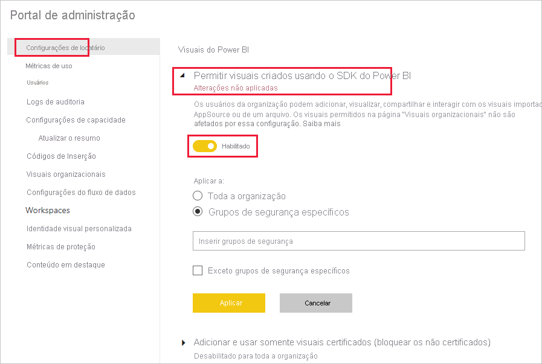
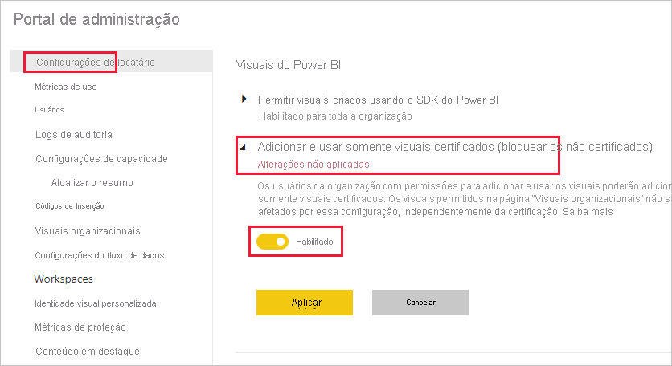
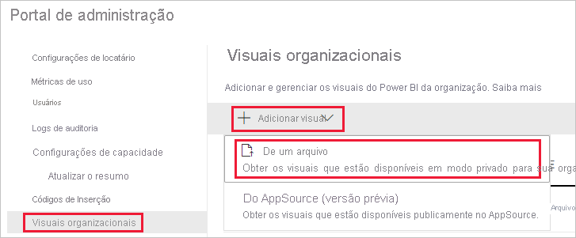
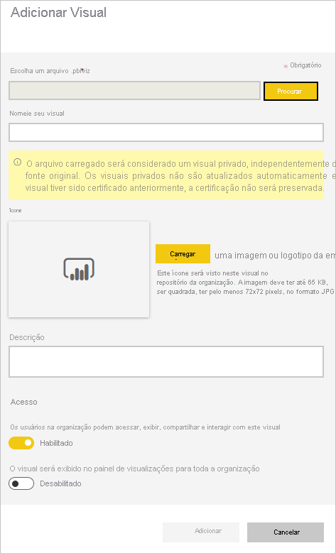

# Gerenciar configurações de administrador de visuais do Power BI

Como um administrador do Power BI para sua organização, é possível controlar quais tipos de visuais do Power BI os usuários podem acessar pela organização.

Para gerenciar os visuais do Power BI, você precisa ser um Administrador Global no Office 365 ou ter tido atribuída a você a função de Administrador de serviços do Power BI. Para obter mais informações sobre a função de administrador de serviços do Power BI, consulte [Noções básicas sobre a função de administrador do Power BI](service-admin-role.md).

## Acessar o portal de administração

Para habilitar as configurações descritas no artigo, você precisará acessar o portal de administração.

1. No serviço do Power BI, selecione **Configurações**.

2. No menu suspenso de configurações, selecione **Portal do administrador**.

    

## Configurações de locatário de visuais do Power BI

Como um administrador do Power BI para sua organização, é possível controlar quais tipos de visuais do Power BI os usuários podem acessar pela organização.

As configurações de locatário da interface do usuário afetam apenas o serviço do Power BI. Se você quiser que essas configurações entrem em vigor no Power BI Desktop, use as políticas de grupo. Uma tabela no final de cada seção fornece detalhes para habilitar a configuração no Power BI Desktop.

>[!NOTE]
>As alterações nas configurações de locatário não afetam elementos visuais do Power BI listados na guia [visuais organizacionais](#organizational-visuals).

### Visuais do AppSource ou de um arquivo

Gerencie o acesso organizacional para o seguinte tipo de visuais do Power BI:

* Visuais criados por desenvolvedores e salvos como um arquivo .pbiviz.

* Visuais disponíveis por meio do AppSource.

Siga as instruções abaixo para permitir que os usuários em sua organização carreguem arquivos .pbiviz e adicionem visuais do AppSource aos próprios relatórios e dashboards.

1. Expanda as configurações **Permitir os visuais criados usando o SDK do Power BI**.

2. Clique em **habilitado**.

3. Escolha quem pode carregar os visuais em .pbiviz e do AppSource:

    * Selecione a opção **Toda a organização** para permitir que todos em sua organização carreguem arquivos .pbiviz e adicionem visuais do AppSource.

     * Selecione a opção **Grupos de segurança específicos** para gerenciar o upload de arquivos .pbiviz e a adição de visuais do AppSource usando grupos de segurança. Adicione os grupos de segurança que você deseja gerenciar à barra de texto *Inserir grupos de segurança*. Os grupos de segurança que você especificou são excluídos por padrão. Se você quiser incluir esses grupos de segurança e excluir todos os outros na organização, selecione a opção **Exceto grupos de segurança específicos**.

4. Clique em **Aplicar**.

As alterações à interface do usuário para as configurações do locatário aplicam-se somente ao serviço do Power BI. Para permitir que os usuários em sua organização carreguem arquivos .pbiviz e adicionem visuais do AppSource aos próprios painéis de visualização no Power BI Desktop, use a [Política de Grupo do Azure AD](https://docs.microsoft.com/azure/active-directory-domain-services/manage-group-policy).

|Key  |Nome do valor  |Valor  |
|---------|---------|---------|
|Software\Políticas\Microsoft\Power BI Desktop\    |EnableCustomVisuals    |0 – Desabilitar  1 – Habilitar (padrão)         |
|

### Visuais do Power BI certificados

Quando essa configuração é habilitada, somente [visuais do Power BI certificados](../developer/visuals/power-bi-custom-visuals-certified.md) são renderizados nos relatórios e dashboards da sua organização. Visuais do Power BI provenientes do AppSource ou de arquivos e que não são certificados retornarão uma mensagem de erro.

1. Do portal do administrador, selecione **Adicionar e usar apenas visuais certificados**.

2. Clique em **habilitado**.

3. Clique em **Aplicar**.

As alterações à interface do usuário para as configurações do locatário aplicam-se somente ao serviço do Power BI. Para gerenciar a configuração de locatário de visuais certificados no Power BI Desktop, use a [Política de Grupo do Azure AD](https://docs.microsoft.com/azure/active-directory-domain-services/manage-group-policy).

|Key  |Nome do valor  |Valor  |
|---------|---------|---------|
|Software\Políticas\Microsoft\Power BI Desktop\    |EnableUncertifiedVisuals    |0 – Desabilitar  1 – Habilitar (padrão)         |
|

## Elementos visuais organizacionais

Como um administrador do Power BI, é possível gerenciar a lista de visuais do Power BI disponíveis no seu [repositório organizacional](../developer/visuals/power-bi-custom-visuals.md#organizational-store). A guia **Visuais organizacionais** no *Portal de administração* permite adicionar e remover visuais, bem como decidir quais visuais serão exibidos automaticamente no painel de visualização dos usuários da sua organização. É possível adicionar qualquer tipo de visual à lista, incluindo visuais não certificados e visuais do .pbiviz, mesmo que eles contradigam as [configurações de locatário](#power-bi-visuals-tenant-settings) da sua organização.

As configurações de visuais organizacionais são implantadas automaticamente para o Power BI Desktop.

>[!NOTE]
>Os visuais organizacionais não são compatíveis com o Servidor de Relatórios do Power BI.

### Adicionar um visual de um arquivo

Use este método para adicionar um novo visual do Power BI de um arquivo .pbiviz.

> [!WARNING]
> Um visual do Power BI carregado de um arquivo pode conter código com riscos de segurança ou privacidade. Verifique se você confia no autor e na fonte do visual antes de implantá-lo no repositório da organização.

1. Selecione **Adicionar visual** > **De um arquivo**.

    

2. Preencha os campos a seguir:

    * **Escolha um arquivo .pbiviz** – selecione um arquivo do visual para carregar.

    * **Nomeie seu visual** – forneça um título curto para o visual, para que os autores de relatório possam entender facilmente o que ele faz.

    * **Ícone** – carregue um arquivo de ícone a ser exibido no painel de visualização.

    * **Descrição** – forneça uma descrição breve do elemento visual para fornecer mais contexto para o usuário.

    * **Acesso** – essa seção tem duas opções:
    
        * Selecione se os usuários em sua organização podem acessar este visual. Essa configuração é habilitada por padrão.

        * Selecione se este visual será exibido no painel de visualização dos usuários em sua organização. Essa configuração é desabilitada por padrão. Para obter mais informações, confira [adicionar um visual ao painel de visualização](#add-a-visual-to-the-visualization-pane).

    

3. Para iniciar a solicitação de carregamento, selecione **Adicionar**. Uma vez carregado, o visual será exibido na lista de visuais organizacionais.

### Adicionar um visual do AppSource (versão prévia)

Use esse método para adicionar um novo visual do Power BI do AppSource.

Os visuais do Power BI do AppSource são atualizados automaticamente. Os usuários em sua organização sempre terão a versão mais recente do visual.

1. Selecione **Adicionar visual** > **Do AppSource**.

    

2. Na janela **Visuais do Power BI**, localize o visual do AppSource que você deseja adicionar e clique em **Adicionar**. Uma vez carregado, o visual será exibido na lista de visuais organizacionais.

### Adicionar um visual ao painel de visualização

É possível escolher visuais da página de visuais organizacionais para serem exibidos automaticamente no painel de visualização de todos os usuários em sua organização.

1. Na linha do visual que você deseja adicionar, clique em **configurações**.

    organizational-pane

2. Habilite a configuração do painel de visualização e clique em **Atualizar**.

    

### Excluir um visual carregado de um arquivo

Para excluir permanentemente o visual, selecione o ícone de lixeira para o visual no repositório.

> [!IMPORTANT]
> A exclusão é irreversível. Depois de excluído, o elemento visual interrompe imediatamente a renderização em relatórios existentes. Mesmo que você carregue o mesmo visual novamente, ele não substituirá aquele que foi excluído. No entanto, os usuários podem importar o novo elemento visual novamente e substituir a instância que eles têm em seus relatórios.

### Desabilitar um visual do .pbiviz

É possível desabilitar um visual do .pbiviz deixando-o indisponível no [repositório organizacional](../developer/visuals/power-bi-custom-visuals.md#organizational-store), mas mantendo-o na lista de visuais da organização.

1. Na linha do visual do .pbiviz que você deseja desabilitar, clique em **configurações**.

2. Na seção **Acesso**, desabilite a configuração: *Os usuários na organização podem acessar, exibir, compartilhar e interagir com esse visual*.

Depois que você desabilitar o visual do .pbiviz, ele não será renderizado em relatórios existentes e exibirá a seguinte mensagem de erro:

*Este visual personalizado não está mais disponível. Entre em contato com o administrador para obter detalhes.*

>[!NOTE]
>Visuais do .pbiviz que forem marcados permanecerão funcionando após terem sido desabilitados.

### Atualizar um elemento visual

Os visuais do AppSource são atualizados automaticamente. Após uma nova versão estar disponível por meio do AppSource, ela substituirá uma versão mais antiga implantada por meio da lista de visuais organizacionais.

Para atualizar e substituir um visual do .pbiviz, siga estas etapas.

1. Na linha do visual que você deseja adicionar, clique em **configurações**.

2. Clique em **Procurar** e selecione o .pbiviz com o qual você deseja substituir o visual atual.

3. Clique em **Atualizar**.

## Próximas etapas

> [!div class="nextstepaction"]
>[Como administrar o Power BI no portal de administração](service-admin-portal.md)

> [!div class="nextstepaction"]
>[Visuais no Power BI](../developer/visuals/power-bi-custom-visuals.md)

> [!div class="nextstepaction"]
>[Visuais organizacionais no Power BI](../developer/visuals/power-bi-custom-visuals-organization.md)