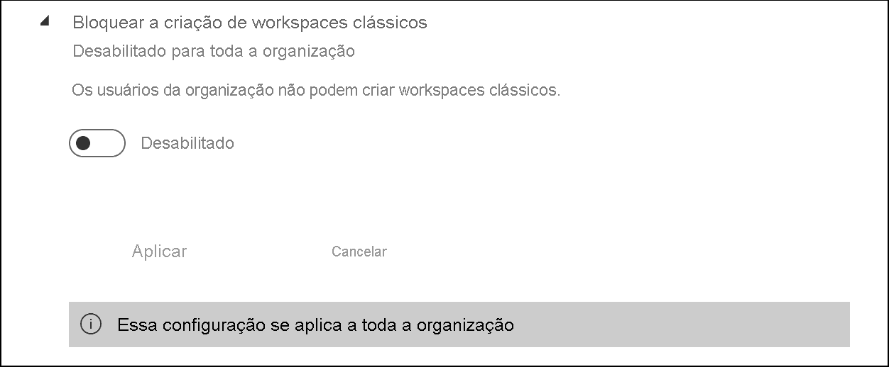
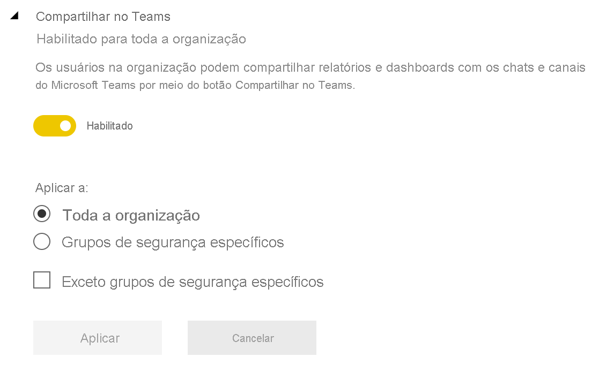

# Como administrar o Power BI no portal de administração

O portal de administração permite que você gerencie as configurações do Power BI para sua organização. O portal inclui itens como métricas de uso, acesso ao centro de administração do Microsoft 365 e configurações de locatário.

O portal de administração completo pode ser acessado por administradores globais e usuários com função de Administrador de serviços do Power BI. Se você não estiver em uma dessas funções, verá apenas **Configurações de capacidade** no portal. Para obter mais informações sobre a função de administrador de serviços do Power BI, consulte [Noções básicas sobre a função de administrador do Power BI](service-admin-role.md).

## Como obter o portal de administração

Para acessar o portal de administração do Power BI, é preciso ser administrador global ou de serviços do Power BI. Para obter mais informações sobre a função de administrador de serviços do Power BI, consulte [Noções básicas sobre a função de administrador do Power BI](service-admin-role.md). Para acessar o portal de administração do Power BI, siga estas etapas:

1. Entre no [Power BI](https://app.powerbi.com) usando suas credenciais de conta de administrador.

1. No cabeçalho da página, selecione **Configurações** > **Portal de administração**.

    

Há várias seções no portal de administração. O restante deste artigo fornece informações sobre cada uma delas.

* [Métricas de uso](#usage-metrics)
* [Usuários](#users)
* [Logs de auditoria](#audit-logs)
* [Configurações de locatário](#tenant-settings)
* [Configurações de capacidade](#capacity-settings)
* [Códigos de inserção](#embed-codes)
* [Elementos visuais organizacionais](organizational-visuals.md#organizational-visuals)
* [Conexões do Azure (versão prévia)](#azure-connections-preview)
* [Workspaces](#workspaces)
* [Identidade visual personalizada](#custom-branding)
* [Métricas de proteção](#protection-metrics)
* [Conteúdo em destaque](#featured-content)

## Métricas de uso

As **métricas de uso** permitem que você monitore o uso do Power BI pela sua organização. Elas também mostram quais usuários e grupos em sua organização são os mais ativos no Power BI.

> [!NOTE]
> Na primeira vez que acessar o dashboard ou depois de visitar novamente após um longo período de não exibição do dashboard, você provavelmente encontrará uma tela de carregamento enquanto carregamos o dashboard.

Quando o dashboard for carregado, você verá duas seções de blocos. A primeira inclui os dados de uso de usuários individuais e a segunda seção tem informações semelhantes para os grupos.

Aqui está um detalhamento do que você verá em cada bloco:

* Contagem distinta de todos os painéis, relatórios e conjuntos de dados no workspace do usuário.
  
    

* Painel mais consumido pelo número de usuários que podem acessá-lo. Por exemplo: É exibido um dashboard mostrando o que você compartilhou com três usuários. Também é exibida a adição de um dashboard a um pacote de conteúdo ao qual dois usuários diferentes se conectaram. A contagem do dashboard será 6 (1 + 3 + 2).
  
    

* Os conteúdo mais populares aos quais os usuários estão conectados. Esse conteúdo pode ser qualquer coisa que os usuários podem acessar por meio do processo Obter Dados, como pacotes de conteúdo SaaS, pacotes de conteúdo organizacional, arquivos ou bancos de dados de conteúdo.

  
    

* Uma exibição de seus principais usuários sobre quantos painéis eles têm, incluindo painéis criados por eles mesmos e painéis compartilhados com eles.
  
    

* Uma exibição de seus principais usuários com base em quantos relatórios eles têm.
  
    

A segunda seção mostra o mesmo tipo de informação, mas com base em grupos. Essa seção permite que você veja quais grupos em sua organização são mais ativos e os tipos de conteúdos que eles estão consumindo.

Com essas informações, você terá insights reais sobre como as pessoas estão usando o Power BI em sua organização.

## Controlar métricas de uso

Os relatórios de métricas de uso são um recurso que o administrador global ou do Power BI pode ativar ou desativar. Os administradores têm controle granular sobre quais usuários dispõem de acesso às métricas de uso. Eles estão **ativados** por padrão para todos os usuários na organização.

Os administradores também podem determinar se os criadores de conteúdo podem ver dados por usuário nas métricas de uso. 

Confira [Monitorar as métricas de uso dos painéis e relatórios do Power BI](../collaborate-share/service-usage-metrics.md) para obter detalhes sobre os próprios relatórios.

### Métricas de uso para criadores de conteúdo

1. No portal de administração, selecione **Configurações de locatário** > **Configurações de auditoria e uso** > **Métricas de uso para criadores de conteúdo**.

    

1. Habilitar (ou desabilitar) métrica de uso > **Aplicar**.

    

### Dados por usuário em métricas de uso para criadores de conteúdo

Por padrão, os dados por usuário estão habilitados para as métricas de uso e as informações de conta estão incluídas no relatório de métricas. Se você não quiser incluir informações de conta para alguns dos usuários ou para nenhum deles, desative esse recurso para grupos de segurança específicos ou para toda a organização. Em seguida, as informações da conta serão mostradas no relatório como *Sem nome*.

### Excluir todo o conteúdo de métricas de uso existente

Ao desabilitar as métricas de uso para toda a organização, os administradores também podem escolher uma ou ambas as opções para:

- **Excluir todo o conteúdo existente de métricas de uso** para excluir todos os relatórios e blocos de painéis existentes que foram criados usando os relatórios de métricas de uso e os conjuntos de dados. Esta opção remove todo o acesso aos dados de métricas de uso para todos os usuários da organização que já podem estar usando esses dados.
- **Excluir todos os dados existentes por usuário no conteúdo atual das métricas de uso** Essa opção remove todo o acesso a dados por usuário de todos os usuários da organização que já podem estar usando-o. 

Tenha cuidado, pois a exclusão do uso existente e do conteúdo de métricas por usuário é irreversível.

## Usuários

O gerenciamento de administradores, grupos e usuários do Power BI é feito no Centro de administração do Microsoft 365. A guia **Usuários** fornece um link para o centro de administração.

## Logs de auditoria

O gerenciamento dos logs de auditoria do Power BI é feito na Central de Segurança e Conformidade do Office 365. A guia **Logs de auditoria** fornece um link para o Centro de Conformidade e Segurança. Para saber mais, confira [Acompanhar atividades do usuário no Power BI](service-admin-auditing.md).

Para usar os logs de auditoria, verifique se a configuração [**Criar logs de auditoria para conformidade e auditoria de atividade interna**](#create-audit-logs-for-internal-activity-auditing-and-compliance) está habilitada.

## Configurações de locatário

A guia **Configurações de locatário** possibilita um controle refinado sobre os recursos disponibilizados para sua organização. Se você tiver dúvidas relacionadas a dados confidenciais, talvez alguns dos nossos recursos não sejam adequados para sua organização, ou talvez você queira apenas que um recurso em particular esteja disponível para um grupo específico.

> [!NOTE]
> As configurações de locatário que controlam a disponibilidade de recursos na interface do usuário do Power BI podem ajudar a estabelecer políticas de governança, mas elas não são uma medida de segurança. Por exemplo, a configuração **Exportar dados** não restringe as permissões de um usuário do Power BI em um conjunto de dados. Os usuários do Power BI com acesso de leitura a um conjunto de dados têm a permissão para consultar esse conjunto de dados e podem persistir os resultados sem usar o recurso **Exportar dados** na interface do usuário do Power BI.

A imagem a seguir mostra as diversas configurações na guia **Configurações de locatário**.

> [!NOTE]
> Pode levar até 15 minutos para que uma alteração de configuração entre em vigor para todos em sua organização.

As configurações podem ter um destes três estados:

* **Desabilitado para toda a organização**: ninguém na sua organização pode usar esse recurso.

    

* **Habilitado para toda a organização**: todos em sua organização podem usar esse recurso.

    

* **Habilitado para um subconjunto da organização**: Em vez de habilitar o recurso para toda a organização, você pode aplicar a configuração a **Grupos de segurança específicos** na organização com permissão para uso desse recurso.

    Você também pode habilitar um recurso para toda a organização e definir a opção **Exceto grupos de segurança específicos**.

    

    Também é possível combinar configurações a fim de habilitar o recurso apenas para um grupo específico de usuários e também desabilitá-lo para um grupo de usuários. O uso dessa abordagem garante que determinados usuários não tenham acesso ao recurso mesmo que estejam no grupo permitido. A configuração mais restritiva é aplicada ao usuário.

    

As próximas seções fornecem uma visão geral dos diferentes tipos de configurações de locatário.

## Configurações de ajuda e suporte

### Publicar as informações "Obter ajuda"

Os administradores podem especificar URLs internas para substituir o destino dos links no menu de ajuda do Power BI e para atualizações de licença. Se as URLs personalizadas forem definidas, os usuários da organização serão direcionados para a ajuda interna e os recursos de suporte, em vez dos destinos padrão. Os seguintes destinos de recursos podem ser personalizados:

* **Aprender**. Por padrão, esse link do menu de ajuda tem como alvo uma [lista de todos os nossos módulos e roteiros de aprendizado do Power BI](https://docs.microsoft.com/learn/browse/?products=power-bi). Para direcionar esse link a recursos de treinamento internos, defina uma URL personalizada para a **Documentação de treinamento**.

* **Comunidade**. Para direcionar os usuários a um fórum interno por meio do menu de ajuda, e não à [Comunidade do Power BI](https://community.powerbi.com/), defina uma URL personalizada para o **Fórum de discussão**.

* **Atualizações de licenciamento**. Os usuários com uma licença do Power BI (Gratuito) podem ter a oportunidade de atualizar suas contas para o Power BI Pro enquanto usam o serviço. Se você especificar uma URL interna para as **Solicitações de licenciamento**, redirecionará os usuários para uma solicitação interna e para o fluxo de compra e impedirá a compra de autoatendimento. Se você deseja impedir que os usuários comprem licenças, mas não vê problema em deixar os usuários iniciarem uma avaliação do Power BI Pro, confira [Permitir que os usuários experimentem o Power BI Pro](#allow-users-to-try-power-bi-pro) para separar as experiências de compra e de avaliação.

* **Obter ajuda**. Para direcionar os usuários a um suporte técnico interno por meio do menu de ajuda, e não ao [Suporte do Power BI](https://powerbi.microsoft.com/support/), defina uma URL personalizada para o **Suporte técnico**.

### Receber notificações por email para interrupções ou incidentes de serviço

Os grupos de segurança habilitados para email receberão notificações por email se esse locatário for afetado por uma interrupção ou um incidente de serviço. Saiba mais sobre as [notificações de interrupção de serviço](service-interruption-notifications.md).

### Permitir que os usuários experimentem o Power BI Pro

A configuração **Permitir que os usuários experimentem Power BI Pro** está habilitada por padrão e aumenta o controle sobre como os usuários adquirem licenças do Power BI Pro. Em cenários em que você bloqueou a compra de autoatendimento, essa configuração permite que os usuários iniciem uma avaliação do Power BI Pro. A experiência do usuário final depende de como você combina as configurações de licença. A tabela abaixo mostra como a experiência de atualização do Power BI (Gratuito) para o Power BI Pro é afetada por diferentes combinações de configuração:

| Configuração de compra de autoatendimento | Configuração "Permitir que o usuário experimente o Power BI Pro" | Experiência do usuário final |
| ------ | ------ | ----- |
| habilitado | Desabilitado | O usuário pode comprar uma licença Pro, mas não consegue iniciar uma avaliação |
| habilitado | habilitado | O usuário pode iniciar uma avaliação gratuita da versão Pro e pode fazer upgrade para uma licença paga |
| Desabilitado | Desabilitado | O usuário vê uma mensagem recomendando que ele contate o administrador de TI para solicitar uma licença |
| Desabilitado | habilitado | O usuário pode iniciar uma avaliação da versão Pro, mas deve contatar o administrador de TI para obter uma licença paga |

> [!NOTE]
> Confira [Configurações de ajuda e suporte](#help-and-support-settings) para saber como adicionar uma URL interna em solicitações licenciamento. Se você definir a URL, ela substituirá a experiência de compra padrão. Os usuários que podem comprar uma licença nos cenários descritos na tabela acima são redirecionados para sua URL interna.

Para saber mais, confira [Habilitar ou desabilitar a inscrição e a compra de autoatendimento](service-admin-disable-self-service.md).

## Configurações do workspace

Em **Configurações de locatário**, o portal de administração tem três seções para controlar os workspaces:

- [Criar as experiências de workspace](#create-the-new-workspaces).
- [Usar conjuntos de dados em workspaces](#use-datasets-across-workspaces).
- [Bloquear a criação de workspaces clássicos](#block-classic-workspace-creation).

### Criar os novos workspaces

Os workspaces são locais onde os usuários podem colaborar em dashboards, relatórios e outros conteúdos. Os administradores usam a configuração **Criar workspaces (nova experiência de workspace)** para indicar quais usuários na organização podem criar workspaces. Os administradores podem permitir que todas as pessoas em uma organização criem experiências de workspaces ou determinar que ninguém pode fazer isso. Eles também podem limitar a criação de membros de grupos de segurança específicos. Saiba mais sobre [workspaces](../collaborate-share/service-new-workspaces.md).

:::image type="content" source="media/service-admin-portal/power-bi-admin-workspace-settings.png" alt-text="Criar as experiências de workspace":::

Para workspaces clássicos com base em grupos do Microsoft 365, a administração continuará a ser feita no portal de administração e no Azure Active Directory.

> [!NOTE]
> Por padrão, a configuração **Criar workspaces (nova experiência de workspace)** permite que somente usuários autorizados a criar Grupos do Microsoft 365 possam criar workspaces do Power BI. Certifique-se de definir um valor no portal de administração do Power BI para garantir que os usuários adequados possam criá-los.

**Lista de workspaces**

O portal de administração tem outra seção de configurações sobre os workspaces em seu locatário. Nesta seção, é possível classificar e filtrar a lista de workspaces e exibir os detalhes de cada um deles. Confira [Workspaces](#workspaces) neste artigo para obter detalhes.

**Publicar aplicativos e pacotes de conteúdo**

No portal de administração, você também controla quais usuários têm permissões para distribuir aplicativos para a organização. Confira [Publicar pacotes de conteúdo e aplicativos para toda a organização](#publish-content-packs-and-apps-to-the-entire-organization).

### Usar conjuntos de dados em workspaces

Os administradores podem controlar quais usuários na organização podem usar conjuntos de dados entre workspaces. Quando essa configuração é habilitada, os usuários ainda precisam da permissão Compilar necessária para um conjunto de dados específico.

:::image type="content" source="media/service-admin-portal/power-bi-admin-datasets-workspaces.png" alt-text="Usar conjuntos de dados em workspaces":::

Confira [Introdução a conjuntos de dados entre workspaces](../connect-data/service-datasets-across-workspaces.md) para saber mais.

### Bloquear a criação de workspaces clássicos

Os administradores podem controlar se a organização pode criar workspaces clássicos. Quando essa configuração é habilitada, os usuários que criam workspaces podem criar apenas novas experiências de workspaces. 

Quando habilitado, grupos recém-criados do Office 365 não são mostrados na lista de workspaces do Power BI. Workspaces clássicos existentes continuam sendo mostrados na lista. Quando a configuração está desabilitada, todos os grupos do Office 365 de que o usuário é membro aparecem na lista de workspaces. Leia mais sobre a [nova experiência de workspaces](../collaborate-share/service-new-workspaces.md).

## Configurações de exportação e compartilhamento

### Permitir que usuários convidados do Azure Active Directory acessem o Power BI

Habilitar essa configuração permite que usuários convidados do Azure AD B2B (Azure Active Directory Business-to-Business) acessem o Power BI. Quando você desabilita essa configuração, os usuários convidados recebem um erro ao tentar acessar o Power BI. Quando você desabilita essa configuração para toda a organização, ela também impede que os usuários convidem pessoas para a organização. Use a opção de grupos de segurança específica para controlar quais usuários convidados podem acessar o Power BI.

### Convidar usuários externos para a organização 

A configuração **Convidar usuários externos para a organização** ajuda as organizações a escolher se novos usuários externos podem ser convidados para a organização por meio de experiências de compartilhamento e permissão do Power BI. Quando desabilitada, se um usuário externo ainda não for um usuário convidado na organização, ele não poderá ser adicionado à organização por meio do Power BI. 

> [!IMPORTANT]
> Essa configuração era chamada anteriormente de "Compartilhar conteúdo com usuários externos". O nome revisado reflete o que a configuração faz com mais precisão.

Para convidar usuários externos para a organização, um usuário também precisa da função de Emissor de convites independente do Azure Active Directory. Essa configuração controla apenas a capacidade de convidar por meio do Power BI. 

### Publicar na Web

Como administrador de um locatário do Power BI, usando a configuração **Publicar na Web**, você tem opções para quais usuários podem criar códigos de inserção a fim de publicar relatórios na Web. Essa funcionalidade disponibiliza o relatório e os respectivos dados para qualquer pessoa na Web. Saiba mais sobre a [publicação na Web](../collaborate-share/service-publish-to-web.md).

> [!NOTE]
> Somente os administradores do Power BI podem permitir a criação de códigos de inserção de publicação na Web. As organizações já podem ter códigos de inserção. Confira a seção [Códigos de inserção](service-admin-portal.md#embed-codes) do portal de administração para examinar os relatórios atualmente publicados.

A imagem a seguir mostra o menu **Mais opções (...)** de um relatório quando a configuração **Publicar na Web** está habilitada.

A configuração **Publicar na Web** do portal de administração fornece opções para quais usuários podem criar códigos de inserção.

Os administradores podem definir **Publicar na Web** como **Habilitado** e **Escolher como os códigos de inserção funcionam** para **Permitir somente os códigos de inserção existentes**. Nesse caso, os usuários podem criar códigos de inserção, mas precisam entrar em contato com o administrador do Power BI para que ele conceda essa permissão.

Os usuários veem diferentes opções na interface do usuário a depender do local onde se encontra a configuração de **Publicar na Web**.

|Recurso |Habilitado para toda a organização |Desabilitado para toda a organização |Grupos de segurança específicos   |
|---------|---------|---------|---------|
|**Publicar na Web** no menu **Mais opções (...)** do relatório|Habilitado para todos|Não visível para todos|Visível somente para usuários ou grupos autorizados.|
|**Gerenciar códigos de inserção** em **Configurações**|Habilitado para todos|Habilitado para todos|Habilitado para todos  Opção * **Excluir** somente para usuários ou grupos autorizados. * **Obter códigos** habilitados para todos.|
|**Códigos de inserção** no portal de administração|O status refletirá uma das seguintes opções: * Ativo * Sem suporte * Bloqueado|O status é exibido como **desabilitado**|O status refletirá uma das seguintes opções: * Ativo * Sem suporte * Bloqueado  Se um usuário não estiver autorizado conforme a configuração do locatário, o status exibirá **Violado**.|
|Relatórios publicados existentes|Tudo habilitado|Tudo desabilitado|Os relatórios continuam a ser renderizados para todos.|

### Exportar dados

Os usuários da organização podem exportar dados de um bloco ou de uma visualização. Isso controla os recursos: analisar no Excel, exportar para .csv, baixar conjunto de dados (.pbix) e Live Connect do Serviço do Power BI. Saiba mais sobre [como exportar dados de um bloco ou de um visual](../visuals/power-bi-visualization-export-data.md).

>[!NOTE]
> Antes da introdução da configuração Exportar para o Excel, essa configuração também controlava a exportação de dados para arquivos do Excel. Confira a [observação em Exportar para o Excel](#export-to-excel) para obter mais detalhes.

A imagem a seguir mostra a opção para exportar dados de um bloco.

> [!NOTE]
> Desabilitar a opção **Exportar dados** também impede os usuários de usar o recurso [Analisar no Excel](../collaborate-share/service-analyze-in-excel.md), bem como de usar a conexão dinâmica do serviço do Power BI.

### Exportar para Excel

Os usuários na organização podem exportar os dados de uma visualização para um arquivo do Excel.

>[!IMPORTANT]
> Antes da introdução da configuração Exportar para o Excel, a exportação para um arquivo do Excel era controlada pela configuração Exportar dados. Portanto, em locatários que existiam antes da introdução da configuração Exportar para o Excel, na primeira vez que os administradores de locatário observarem essa configuração, eles verão que ela tem *Alterações não aplicadas*. Eles deverão aplicar essas alterações para que a nova configuração entre em vigor. Caso contrário, a exportação para um arquivo do Excel continuará sendo controlada pela configuração Exportar dados.

### Exportar relatórios como apresentações do PowerPoint ou documentos PDF

Os usuários da organização podem exportar relatórios do Power BI como arquivos do PowerPoint ou documentos PDF. [Saiba mais](../consumer/end-user-powerpoint.md)

A imagem a seguir mostra o menu **Arquivo** de um relatório quando a configuração **Exportar relatórios como apresentações do PowerPoint ou documentos PDF** está habilitada.

### Imprimir painéis e relatórios

Os usuários na organização podem imprimir dashboards e relatórios. [Saiba mais](../consumer/end-user-print.md)

A imagem a seguir mostra a opção para imprimir um painel.

A imagem a seguir mostra o menu **Arquivo** de um relatório quando a configuração **Imprimir painéis e relatórios** está habilitada.

### Permitir que os usuários externos convidados editem e gerenciem o conteúdo da organização

Os usuários convidados B2B do Azure AD podem editar e gerenciar conteúdo na organização. [Saiba mais](service-admin-azure-ad-b2b.md)

A imagem a seguir mostra a opção de permitir que os usuários externos convidados editem e gerenciem o conteúdo da organização.

No portal de administração, você também controla quais usuários têm permissões para convidar usuários externos para a organização. Confira [Compartilhar conteúdo com usuários externos](#export-and-sharing-settings) neste artigo para obter detalhes.

### Assinaturas de email
Os usuários na organização podem criar assinaturas de email. Saiba mais sobre [assinaturas](../collaborate-share/service-publish-to-web.md).

### Conteúdo em destaque

Permita que alguns ou todos os autores de relatório em sua organização destaquem seu conteúdo na seção Em Destaque da Página Inicial do Power BI. Novos usuários verão o conteúdo em destaque na parte superior da Página Inicial do Power BI. O conteúdo em destaque desce na página inicial à medida que os usuários adicionam **Favoritos**, **Frequentes** e **Recentes**. 

Recomenda-se começar com um pequeno conjunto de promotores primeiro. Permitir que toda a organização destaque o conteúdo na Página Inicial pode dificultar o controle de todo o conteúdo promovido. 

Depois de habilitar o conteúdo em destaque, você também poderá gerenciá-lo no portal do Administrador. Confira [Gerenciar conteúdo em destaque](#manage-featured-content) neste artigo para ler sobre como controlar o conteúdo em destaque em seu domínio.

## Configurações de aplicativo e pacote de conteúdo

### Publicar aplicativos e pacotes de conteúdo em toda a organização

Os administradores usam essa configuração para decidir quais usuários podem publicar pacotes de conteúdo e aplicativos para toda a organização, em vez de grupos específicos. Saiba mais sobre como [publicar aplicativos](../collaborate-share/service-create-distribute-apps.md).

A imagem a seguir mostra a opção **Minha organização inteira** durante a criação de um pacote de conteúdo.

### Criar aplicativos de modelo e pacotes de conteúdo organizacional

Os usuários na organização podem criar aplicativos de modelo e pacotes de conteúdo organizacional que usam conjuntos de dados criados em uma fonte de dados no Power BI Desktop. Saiba mais sobre [aplicativos de modelo](../connect-data/service-template-apps-create.md).

### Enviar aplicativos por push para usuários finais

Os criadores de relatório podem compartilhar aplicativos diretamente com os usuários finais sem exigir a instalação do [AppSource](https://appsource.microsoft.com). Saiba mais sobre como [instalar aplicativos automaticamente para os usuários finais](../collaborate-share/service-create-distribute-apps.md#automatically-install-apps-for-end-users).

## Configurações de integração

### Usar a opção Analisar no Excel com conjuntos de dados locais

Os usuários na organização podem usar o Excel para exibir e interagir com conjuntos de dados locais do Power BI. [Saiba mais](../collaborate-share/service-analyze-in-excel.md)

> [!NOTE]
> Desabilitar a opção **Exportar Dados** também impede os usuários de usar o recurso **Analisar no Excel**.

### Usar o ArcGIS Maps for Power BI

Os usuários na organização podem usar a visualização do ArcGIS Maps for Power BI, fornecida pela Esri. [Saiba mais](../visuals/power-bi-visualization-arcgis.md)

### Usar a pesquisa global para o Power BI (versão prévia)

Os usuários na organização podem usar recursos de pesquisa externos que se baseiam no Azure Search.

## Configurações de tabelas em destaque

Em **Configurações de locatário**, a configuração de locatário **Permitir conexões com tabelas em destaque** permite que administradores do Power BI controlem quem na organização pode usar tabelas em destaque na Galeria de tipos de dados do Excel. 

:::image type="content" source="media/service-admin-portal/admin-allow-connections-featured-tables.png" alt-text="Todas as conexões a tabelas em destaque":::

As conexões a tabelas em destaque também serão desabilitadas se a configuração de locatário **Exportar dados** estiver definida como **Desabilitado**.

Confira [Tabelas em destaque no Excel do Power BI](../collaborate-share/service-excel-featured-tables.md).

## Configuração de locatário Compartilhar no Teams

A configuração **Compartilhar com o Teams** está na seção **Configurações de locatário** do portal de administração do Power BI. Essa configuração permite que as organizações ocultem os botões **Compartilhar com o Teams** no serviço do Power BI. Com a configuração desabilitada, os usuários não veem os botões **Compartilhar com o Teams** na barra de ação nem nos menus de contexto quando exibem relatórios e dashboards no serviço do Power BI.

Leia mais sobre o [compartilhamento de conteúdo do Power BI com o Teams](../collaborate-share/service-share-report-teams.md).

## Configurações de elementos visuais do R

### Interagir e compartilhar visuais do R

Os usuários na organização podem interagir e compartilhar elementos visuais criados com scripts do R. [Saiba mais](../visuals/service-r-visuals.md)

> [!NOTE]
> Essa configuração se aplica a toda a organização e não pode ser limitada a grupos específicos.

## Configurações de auditoria e de uso

### Criar logs de auditoria para conformidade e auditoria de atividade interna

Os usuários na organização podem usar a auditoria para monitorar as ações executadas no Power BI por outros usuários na organização. [Saiba mais](service-admin-auditing.md)

Essa configuração deve ser habilitada para que as entradas de log de auditoria sejam registradas. Pode haver um atraso de até 48 horas entre a habilitação da auditoria e a possibilidade de exibir dados de auditoria. Se os dados não forem exibidos imediatamente, verifique os logs de auditoria mais tarde. Pode haver um atraso semelhante entre a obtenção da permissão para exibir os logs de auditoria e a possibilidade de acessá-los.

> [!NOTE]
> Essa configuração se aplica a toda a organização e não pode ser limitada a grupos específicos.

### Métricas de uso para criadores de conteúdo

Os usuários na organização podem ver métricas de uso para painéis e relatórios que eles criaram. [Saiba mais](../collaborate-share/service-usage-metrics.md)

### Dados por usuário em métricas de uso para criadores de conteúdo

As métricas de uso para criadores de conteúdo expõem os nomes de exibição e os endereços de email dos usuários que estão acessando o conteúdo. [Saiba mais](../collaborate-share/service-usage-metrics.md)

Os dados por usuário são habilitados para as métricas de uso, por padrão, e as informações de conta do criador do conteúdo estão incluídas no relatório de métricas. Se você não quiser coletar essas informações para todos os usuários, desabilite o recurso para grupos de segurança especificados ou para toda a organização. As informações da conta para os usuários excluídos serão exibidas no relatório como *Sem nome*.

## Configurações do dashboard

### Classificação de dados para dashboards

Os usuários na organização podem marcar painéis com classificações indicando os níveis de segurança do painel. [Saiba mais](../create-reports/service-data-classification.md)

> [!NOTE]
> Essa configuração se aplica a toda a organização e não pode ser limitada a grupos específicos.

## Configurações de desenvolvedor

### Inserir conteúdo em aplicativos

Usuários da organização podem inserir relatórios e dashboards do Power BI em aplicativos de SaaS (software como serviço). Desabilitar essa configuração impede os usuários de usar as APIs REST para inserir conteúdo do Power BI em seus aplicativos. [Saiba mais](../developer/embedded/embedding.md)

### Permitir que as entidades de serviço usem APIs do Power BI

Os aplicativos Web registrados no Azure Active Directory (Azure AD) usarão uma entidade de serviço atribuída para acessar as APIs do Power BI sem um usuário conectado. Para permitir que um aplicativo use a autenticação da entidade de serviço, sua entidade deve estar incluída em um grupo de segurança permitido. [Saiba mais](../developer/embedded/embed-service-principal.md)

> [!NOTE]
> As entidades de serviço herdam as permissões para todas as configurações de locatário do Power BI de seu grupo de segurança. Para restringir permissões, crie um grupo de segurança dedicado para entidades de serviço e adicione-o à lista "Exceto grupos de segurança específicos" para as configurações relevantes habilitadas do Power BI.

## Configurações do fluxo de dados

### Criar e usar fluxos de dados

Os usuários na organização podem criar e usar fluxos de dados. Para obter uma visão geral dos fluxos de dados, confira [Preparação de dados de autoatendimento no Power BI](../transform-model/service-dataflows-overview.md). Para habilitar os fluxos de dados em uma capacidade Premium, consulte [Configurar cargas de trabalho](service-admin-premium-workloads.md).

> [!NOTE]
> Essa configuração se aplica a toda a organização e não pode ser limitada a grupos específicos.

## Configurações do aplicativo de modelo

As três configurações controlam a capacidade de aplicativos de modelo para publicar ou instalar aplicativos de modelo.

### Publicar aplicativos de modelo

Os usuários na organização podem criar workspaces de aplicativos de modelo. Controle quais usuários podem publicar aplicativos de modelo ou distribuí-los para clientes fora de sua organização por meio do [AppSource](https://appsource.microsoft.com) ou de outro método de distribuição.

### Instalar aplicativos de modelo listados no AppSource

Os usuários da organização podem baixar e instalar aplicativos de modelo **somente** do [AppSource](https://appsource.microsoft.com). Controle quais usuários específicos ou grupos de segurança podem instalar aplicativos de modelo do AppSource.

### Instalar aplicativos de modelo não listados no AppSource

Controle quais usuários na organização podem baixar e instalar aplicativos de modelo **não listados no [AppSource](https://appsource.microsoft.com)** .

## Configurações de capacidade

### Power BI Premium

A guia **Power BI Premium** permite que você gerencie qualquer capacidade do Power BI Premium (SKU EM ou P) que tenha sido comprada para sua organização. Todos os usuários na organização podem ver a guia **Power BI Premium**, mas só verão conteúdo nela se forem atribuídos como *Administradores de capacidade* ou se forem um usuário com permissões de atribuição. Se um usuário não tiver nenhuma permissão, a mensagem de erro a seguir será exibida.

### Power BI Embedded

A guia **Power BI Embedded** permite que você exiba suas capacidades do Power BI Embedded (SKU A) que comprou para o cliente. Como você só pode comprar SKUs A do Azure, [gerencie capacidades incorporadas no Azure](../developer/embedded/azure-pbie-create-capacity.md) do **portal do Azure**.

Para saber mais sobre como gerenciar as configurações do Power BI Embedded (SKU A), confira [O que é o Power BI Embedded](../developer/embedded/azure-pbie-what-is-power-bi-embedded.md).

## Códigos de inserção

Como administrador, você pode exibir os códigos de inserção que são gerados para seu locatário para compartilhar os relatórios publicamente. Você também pode revogar ou excluir códigos. [Saiba mais](../collaborate-share/service-publish-to-web.md)

## Elementos visuais organizacionais

Todas as configurações de administração de visuais do Power BI, incluindo configurações de locatário de visuais, estão descritas em [Gerenciar configurações de administração de visuais do Power BI](organizational-visuals.md).

## Conexões do Azure (versão prévia)

### Armazenamento no nível do locatário (versão prévia)

Por padrão, os dados usados com o Power BI são armazenados no armazenamento interno fornecido pelo Power BI. Com a integração de fluxos de dados e o Azure Data Lake Storage Gen2 (ADLS Gen2), você pode armazenar seus fluxos de dados na conta do Azure Data Lake Storage Gen2 da sua organização. Para saber mais, confira [Integração entre fluxos de dados e o Azure Data Lake (versão prévia)](../transform-model/service-dataflows-azure-data-lake-integration.md).

### Permissões de armazenamento no nível do workspace (versão prévia)

Por padrão, os administradores do workspace não podem conectar as contas de armazenamento deles. Esta versão prévia do recurso permite ativar uma configuração para que os administradores do workspace possam conectar suas contas de armazenamento.

## Workspaces

Como administrador, você pode exibir os workspaces existentes em seu locatário na guia **Workspaces**. Nessa guia, você pode executar as seguintes ações:

- Atualizar a lista de workspaces e seus detalhes.
- Exportar os dados sobre os workspaces para um arquivo .csv. 
- Ver os detalhes sobre um workspace, incluindo ID, usuários e suas funções, dashboards, relatórios e conjuntos de dados.
- Editar a lista de pessoas com acesso. Isso significa que você pode excluir o workspace. Para isso, você pode se adicionar como administrador de um workspace e abri-lo para exclusão.
- Editar os campos Nome e Descrição.

Os administradores também podem controlar a capacidade dos usuários de criar experiências de workspaces e de trabalhar com workspaces e workspaces clássicos. Confira a sessão [Configurações de workspace](#workspace-settings) neste artigo para obter mais detalhes. 

As colunas da tabela na guia **Workspaces** correspondem às propriedades retornadas pela [API Rest do administrador do Power BI](/rest/api/power-bi/admin) para workspaces. Os espaços de trabalho pessoais são do tipo **PersonalGroup**, os espaços de trabalho clássicos são do tipo **Group** e os espaços de trabalho de experiência do novo espaço de trabalho são do tipo **Workspace**. Para obter mais informações, confira [Organizar o trabalho nos novos workspaces](../collaborate-share/service-new-workspaces.md).

Na guia **Workspaces**, você vê o *estado* de cada workspace. A tabela a seguir fornece mais detalhes sobre o significado desses estados.

|Estado  |Descrição  |
|---------|---------|
| **Ativo** | Um workspace normal. Não indica nada sobre o uso ou o que está dentro, apenas que o workspace em si está "normal". |
| **Órfão** | Um workspace sem usuário administrador. |
| **Excluída** | Um workspace excluído. Mantemos metadados suficientes para restaurar o workspace por até 90 dias, se desejado. |
| **Removendo** | Um workspace no processo de ser excluído, mas que ainda não foi. Os usuários podem excluir seus próprios workspaces, colocando as coisas no estado Removendo e, eventualmente, Excluído. |

Os administradores também podem gerenciar e recuperar workspaces usando o portal de administração ou cmdlets do PowerShell. 

## Identidade visual personalizada

Como administrador, você pode personalizar a aparência do Power BI para toda a organização. Atualmente, há três opções principais:

* **Carregar logotipo**: para obter melhores resultados, carregue um logotipo salvo como .png de 10 KB ou menor, e com pelo menos 200 x 30 pixels.

* **Carregar imagem de capa**: para obter melhores resultados, carregue uma imagem de capa salva como .jpg ou .png de 1 MB ou menor, e com pelo menos 1920 x 160 pixels.

* **Selecionar cores do tema**: você pode selecionar o tema com base em um número hexadecimal, RGB, valor ou palete fornecido.

Para saber mais, confira o tópico [Personalizar a identidade visual da organização](https://aka.ms/orgBranding).

## Métricas de proteção

Depois que você habilita a proteção de informações do Power BI, as métricas de proteção de dados são exibidas no portal de administração. O relatório mostra como os rótulos de confidencialidade ajudam a proteger seu conteúdo.

## Gerenciar conteúdo de destaque

Como administrador de locatários, você pode gerenciar todos os relatórios, dashboards e aplicativos que foram promovidos para a seção em destaque na Página Inicial do Power BI em toda a sua organização.

- No portal do Administrador, selecione **Conteúdo em destaque**.

Aqui, você terá uma visão geral de quem destacou o conteúdo, quando ele foi destacado e todos os seus metadados relevantes. Se algo parecer suspeito ou se você quiser limpar a seção Em Destaque, poderá excluir o conteúdo promovido conforme necessário.

Confira [Conteúdo em destaque](#featured-content) neste artigo para obter informações sobre como habilitar o conteúdo em destaque.

## Próximas etapas

[Administração do Power BI em sua organização](service-admin-administering-power-bi-in-your-organization.md)  
[Noções básicas sobre a função de administrador do Power BI](service-admin-role.md)  
[Auditoria do Power BI em sua organização](service-admin-auditing.md)  

Mais perguntas? [Experimente perguntar à Comunidade do Power BI](https://community.powerbi.com/)
