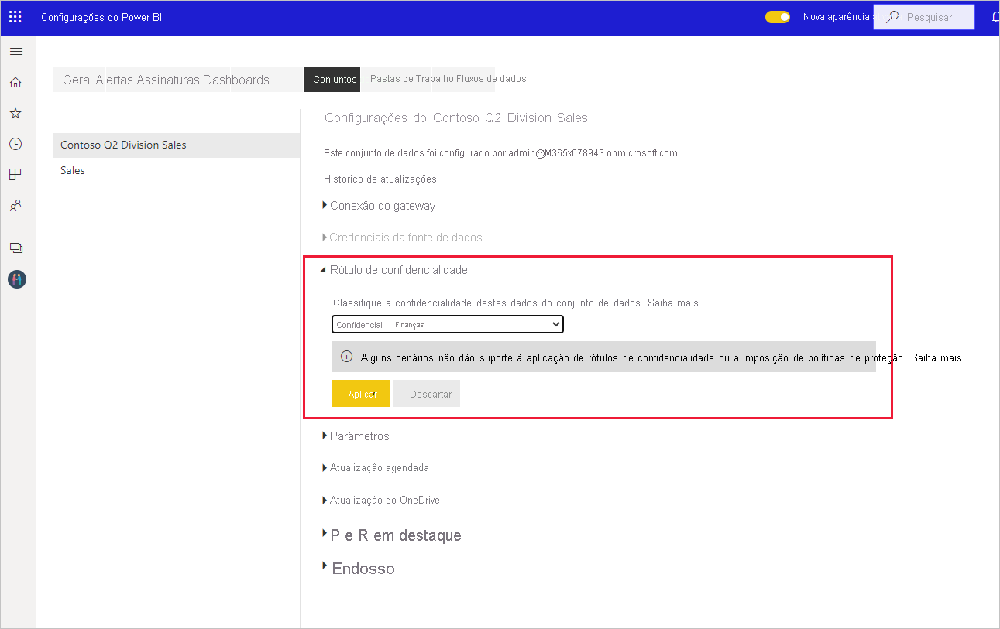

# Como aplicar rótulos de confidencialidade no Power BI

Os rótulos de confidencialidade da Proteção de Informações da Microsoft para os seus relatórios, dashboards, conjuntos de dados e fluxos de dados podem proteger o seu conteúdo confidencial contra acesso a dados não autorizado e vazamentos. Rotular seus dados corretamente usando rótulos de confidencialidade garante que apenas pessoas autorizadas possam acessar seus dados. Este artigo mostra como aplicar rótulos de confidencialidade ao seu conteúdo.

Para ser capaz de aplicar rótulos de confidencialidade no Power BI:
* Você precisa ter uma licença do Power BI Pro e permissões de edição no conteúdo que deseja rotular.
* Você precisa pertencer a um grupo de segurança que tenha permissões para aplicar rótulos de confidencialidade, conforme descrito no artigo intitulado [Habilitar rótulos de confidencialidade no Power BI](./service-security-enable-data-sensitivity-labels.md).
* Todos os [critérios de licenciamento e outros requisitos](./service-security-enable-data-sensitivity-labels.md#licensing-and-requirements) devem ser atendidos.

Para obter mais informações sobre rótulos de confidencialidade no Power BI, confira [Rótulos de confidencialidade no Power BI](service-security-sensitivity-label-overview.md).

## Aplicar rótulos de confidencialidade

Quando a proteção de dados está habilitada no seu locatário, os rótulos de confidencialidade aparecem na coluna de confidencialidade na exibição de lista dos dashboards, relatórios, conjuntos de dados e fluxos de dados.

**Para aplicar ou alterar um rótulo de confidencialidade em um relatório ou dashboard**
1. Clique em **Mais opções (...)** .
1. Selecione **Configurações**.
1. No painel lateral de configurações, escolha o rótulo de confidencialidade apropriado.
1. Salve as configurações.

A imagem a seguir ilustra essas etapas em um relatório

**Para aplicar ou alterar um rótulo de confidencialidade em um conjunto de dados ou fluxo de dados**

1. Clique em **Mais opções (...)** .
1. Selecione **Configurações**.
1. No painel lateral de configurações, escolha o rótulo de confidencialidade apropriado.
1. Aplique as configurações.

As duas imagens a seguir ilustram essas etapas em um conjunto de dados.

Escolha **Mais opções (...)** e, em seguida, **Configurações**.

Na página de configurações, abra a seção do rótulo de confidencialidade, escolha o rótulo de confidencialidade desejado e clique em **Aplicar**.

## Como remover rótulos de confidencialidade
Para remover um rótulo de confidencialidade de um relatório, um dashboard, um conjunto de dados ou um fluxo de dados, siga o [mesmo procedimento usado para aplicar rótulos](#applying-sensitivity-labels), mas escolha **(Nenhum)** quando precisar classificar a confidencialidade dos dados. 

## Considerações e limitações

Confira [Rótulos de confidencialidade no Power BI](service-security-sensitivity-label-overview.md#limitations) para obter a lista de limitações de rótulo de confidencialidade no Power BI.

## Próximas etapas

Este artigo descreveu como aplicar rótulos de confidencialidade no Power BI. Os artigos a seguir fornecem mais detalhes sobre a proteção de dados no Power BI. 

* [Visão geral de rótulos de confidencialidade no Power BI](./service-security-sensitivity-label-overview.md)
* [Habilitar rótulos de confidencialidade no Power BI](./service-security-enable-data-sensitivity-labels.md)
* [Usando controles do Microsoft Cloud App Security no Power BI](./service-security-using-microsoft-cloud-app-security-controls.md)