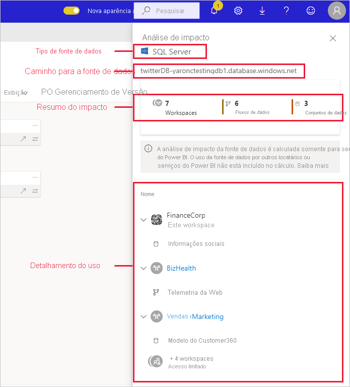
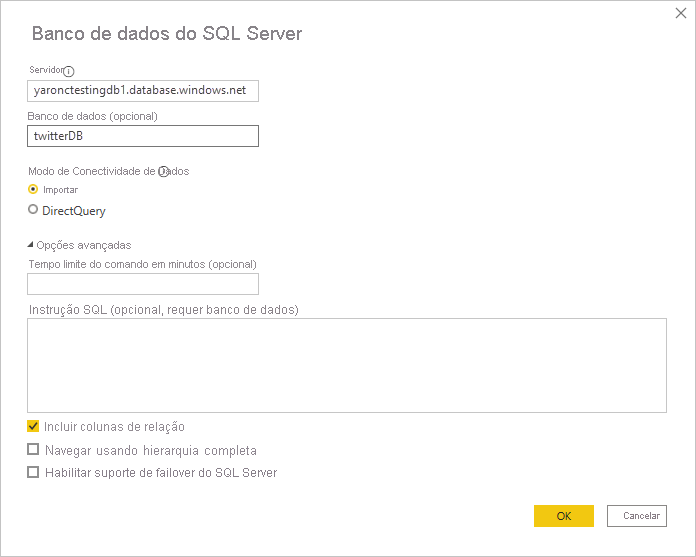

# Análise de impacto da fonte de dados

A análise de impacto da fonte de dados ajuda você a ver onde sua fonte de dados está sendo usada na organização. Isso pode ser útil quando a fonte de dados fica offline temporária ou permanentemente e você quer saber quem é afetado. Ela mostra quantos workspaces, fluxos de dados e conjuntos de dados usam a fonte de dados e proporciona uma navegação fácil para os workspaces nos quais esses fluxos de dados e conjuntos de dados afetados se encontram para que você possa investigar mais.

A análise de impacto da fonte de dados também pode ajudar você a identificar casos de duplicação de dados no locatário, por exemplo, quando vários usuários criam modelos semelhantes com base na mesma fonte de dados. Ajudando a detectar esses conjuntos de dados e fluxos de dados redundantes, a análise de impacto da fonte de dados dá suporte à meta de ter "uma só fonte de verdade".

## Executar a análise de impacto da fonte de dados

Para executar a análise de impacto da fonte de dados:

1. Vá até o workspace que contém a fonte de dados na qual você tem interesse e abra a [exibição de linhagem](service-data-lineage.md).
1. Localize o cartão da fonte de dados e clique no ícone da análise de impacto.

    
 
O painel lateral da análise de impacto é aberto.

 
* **Tipo de fonte de dados**: indica o tipo de fonte de dados
* **Caminho para a fonte de dados**: caminho para a fonte de dados, conforme definido no Power BI Desktop. Por exemplo, na imagem acima, o caminho para a fonte de dados do banco de dados do SQL Server é a cadeia de conexão "twitterDB-yaronctestingdb1.database.windows.net", conforme definido no Power BI Desktop (mostrado abaixo). Ele é composto pelo nome do banco de dados "twitterDB" e pelo nome do servidor "yaronctestingdb1.database.windows.net".

    
 
* **Resumo de impacto**: mostra o número de workspaces, fluxos de dados e conjuntos de dados potencialmente afetados. Essa contagem inclui workspaces aos quais você não tem acesso.
* **Detalhamento do uso**: mostra, para cada workspace, os nomes dos fluxos de dados e dos conjuntos de dados afetados. Para explorar ainda mais o impacto em um workspace específico, clique no nome dele para abri-lo. No workspace afetado, use a [análise de impacto do conjunto de dados](service-dataset-impact-analysis.md) para ver os detalhes de uso dos relatórios e dashboards conectados.

## Privacidade

No painel lateral da análise de impacto, só é possível ver os nomes reais dos workspaces, conjuntos de dados e fluxos de dados aos quais você tem acesso. Os itens aos quais você não tem acesso são listados como Acesso limitado. Isso ocorre porque alguns nomes de item podem conter informações pessoais.
As contagens do resumo de impacto incluem todos os fluxos de dados e conjuntos de dados afetados, até mesmo os que residem em workspaces aos quais você não tem acesso.

## Limitações

A análise de impacto da fonte de dados ainda não tem suporte para relatórios paginados, de modo que você não verá se a fonte de dados tem impacto direto sobre esse tipo de relatório no locatário.

## Próximas etapas

* [Análise do impacto do conjunto de dados](service-dataset-impact-analysis.md)
* [Linhagem de dados](service-data-lineage.md)