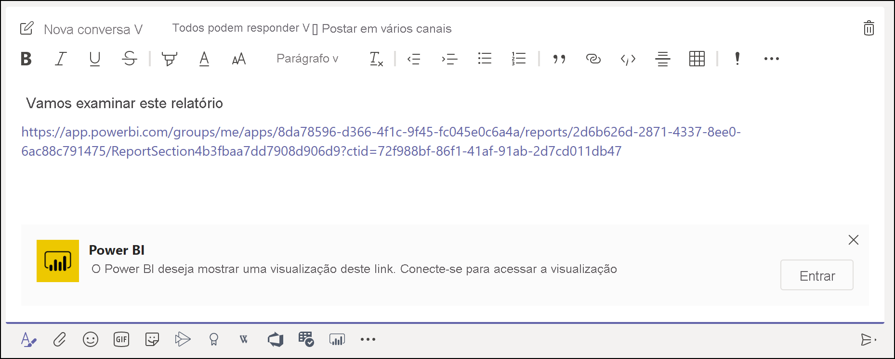
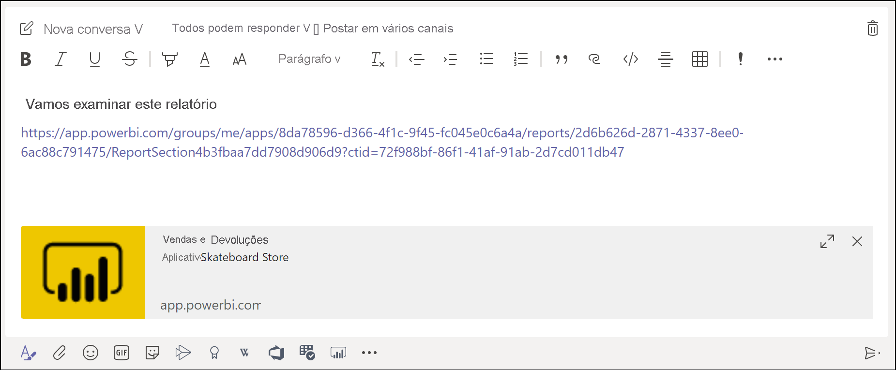
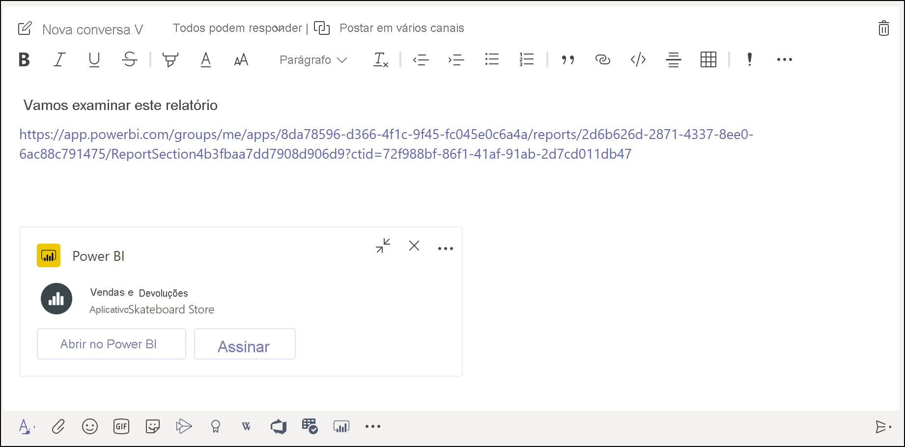

# Obter uma visualização de link do Power BI no Microsoft Teams

Quando você cola um link em seus relatórios, dashboards e aplicativos na caixa de mensagem do Microsoft Teams, a visualização do link mostra informações sobre ele. As visualizações de link são fornecidas para os seguintes itens no Power BI:

- Relatórios
- Dashboards
- Aplicativos

O serviço de visualização de link exige a entrada dos usuários. Para sair, selecione o ícone do **Power BI** na parte inferior da caixa de mensagem. Em seguida, selecione **Sair**.

Confira [Colaborar no Microsoft Teams com o Power BI](service-collaborate-microsoft-teams.md) para saber como o Power BI e o Teams funcionam juntos, incluindo os requisitos que você precisa atender.

## Obter uma visualização de link

Siga estas etapas para obter uma visualização de link para o conteúdo no serviço do Power BI.

1. Copie um link para um relatório, um dashboard ou um aplicativo no serviço do Power BI. Por exemplo, copie o link da barra de endereços do navegador.

1. Cole o link na caixa de mensagem do Microsoft Teams. Entre no serviço de visualização de link, se solicitado. Talvez seja necessário aguardar alguns segundos para que a visualização do link seja carregada.

    

1. A visualização de link básica é exibida após a entrada bem-sucedida.

    

1. Selecione o ícone de **Expandir** para mostrar o cartão de visualização avançada.

    

1. O cartão de visualização de link avançada mostra o link e os botões de ação relevantes.

    

1. Envie a mensagem.

## Limitações e problemas conhecidos

- Não há suporte para logon único no serviço de visualização de link.
- As visualizações de link não funcionam em chat de reuniões ou canais privados.
- Confira a seção [Limitações e problemas conhecidos](service-collaborate-microsoft-teams.md#known-issues-and-limitations) do artigo "Colaborar no Microsoft Teams" para ver outros problemas.

## Próximas etapas

- [Colaborar no Microsoft Teams com o Power BI](service-collaborate-microsoft-teams.md)

Mais perguntas? [Experimente perguntar à Comunidade do Power BI](https://community.powerbi.com/).
