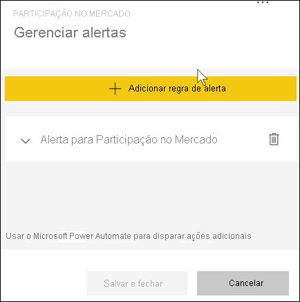

# Tutorial: definir alertas nos dashboards do Power BI

[!INCLUDE[consumer-appliesto-yynn](../includes/consumer-appliesto-yynn.md)]

[!INCLUDE [power-bi-service-new-look-include](../includes/power-bi-service-new-look-include.md)]

Defina alertas no serviço do Power BI para receber notificações quando os dados em um dashboard forem alterados acima ou abaixo dos limites definidos. Os alertas só podem ser definidos em blocos fixos de visuais de relatório e apenas em medidores, KPIs e cartões. 

Os alertas podem ser criados em dashboards:
- que você criou e salvou em **Meu workspace**
- que foram compartilhados com você em uma [capacidade Premium](end-user-license.md). 
- em qualquer worskpace ao qual você tenha acesso, caso tenha uma licença do Power BI Pro.    

Os alertas funcionam somente em dados que estão atualizados. Depois que os dados são atualizados, o Power BI verifica se foi definido um alerta para esses dados. Se os dados atingirem um limite de alerta, um alerta será disparado. 

Este recurso ainda está em evolução, portanto, confira a [seção abaixo: Dicas e solução de problemas](#tips-and-troubleshooting).

Apenas você poderá ver os alertas que definir, mesmo se compartilhar seu dashboard. Os alertas de dados são totalmente sincronizados nas plataformas; defina e exiba alertas de dados [nos aplicativos móveis do Power BI](mobile/mobile-set-data-alerts-in-the-mobile-apps.md) e no serviço do Power BI. 

> [!WARNING]
> Esses alertas fornecem informações sobre seus dados. Se você exibir os dados do Power BI em um dispositivo móvel e esse dispositivo for roubado, será recomendável usar o serviço do Power BI para desligar todos os alertas.
> 

Este tutorial aborda o seguinte.
> [!div class="checklist"]
> * Quem pode definir alertas
> * Quais visuais são compatíveis com alertas
> * Quem pode ver meus alertas
> * Se os alertas funcionam no Power BI Desktop e Mobile
> * Como criar um alerta
> * Onde os alertas serão recebidos

## Pré-requisitos

Se você não estiver inscrito no Power BI, [inscreva-se para uma avaliação gratuita](https://app.powerbi.com/signupredirect?pbi_source=web) antes de começar.

1. Este exemplo usa um bloco de cartão do dashboard do exemplo Vendas e Marketing. Abra o serviço do Power BI (app.powerbi.com), conecte-se e abra **Meu Workspace**.    
    

2. No canto inferior esquerdo, selecione **Obter dados**.

    

3. Quando aparecer a página Obter dados, selecione **Exemplos**.

4. Escolha o Exemplo de Vendas e Marketing e selecione **Conectar**.

    

5. Depois que o Power BI tiver se conectado ao exemplo, selecione **Ir para o dashboard** na caixa de diálogo exibida.     
    

## Adicionar um alerta a um bloco de dashboard

1. Em um medidor, KPI ou bloco de cartão do dashboard, selecione as reticências.
   
   

2. Selecione o ícone de alerta  ou **Gerenciar alertas** a fim de adicionar um ou mais alertas para o cartão de **Participação no mercado**.

   

   
1. No painel **Gerenciar alertas**, selecione **+ Adicionar regra de alerta**.  Verifique se o controle deslizante está definido como **Ligado** e dê um título ao seu alerta. Os títulos ajudam a reconhecer facilmente seus alertas.
   
   
4. Role para baixo e insira os detalhes do alerta.  Neste exemplo, criaremos um alerta que notificará uma vez por dia caso a participação de mercado aumente para 40 ou mais. Os alertas serão exibidos em nosso [Centro de notificações](end-user-notification-center.md). Além disso, o Power BI vai nos enviar um email.
   
   

5. Selecione **Salvar e fechar**.
 

   > 

## Recebendo alertas
Quando os dados que estão sendo controlados atingem um dos limites que você definiu, várias coisas acontecerão. Primeiro, o Power BI verifica se passou mais de uma hora ou mais de 24 horas (dependendo da opção selecionada) desde o envio do último alerta. Enquanto os dados estiverem acima do limite, você receberá um alerta.

Em seguida, o Power BI enviará um alerta para o centro de notificações e, como opção, para o email. Cada alerta contém um link direto com seus dados. Selecione o link para ver o bloco relevante.  

1. Se tiver definido que o alerta deve lhe enviar um email, você verá algo parecido com isto na Caixa de Entrada. No exemplo abaixo, definimos um alerta para o cartão de **Sentimento**.
   
   
2. O Power BI também adiciona uma mensagem no **Centro de notificações**.
   
   
3. Abra a Central de Notificações para ver os detalhes do alerta.
   
    
   
  

## Gerenciando alertas

Existem várias maneiras de gerenciar seus alertas: no próprio bloco do dashboard, no menu Configurações do Power BI ou em um bloco individual no [aplicativo móvel do Power BI para iPhone](mobile/mobile-set-data-alerts-in-the-mobile-apps.md) ou no [aplicativo móvel do Power BI para Windows 10](mobile/mobile-set-data-alerts-in-the-mobile-apps.md).

### No próprio bloco

1. Se você precisar alterar ou remover um alerta em um bloco, abra novamente a janela **Gerenciar alertas** selecionando o ícone de alerta . Todos os alertas definidos para esse bloco são exibidos.
   
    .
2. Para modificar um alerta, selecione a seta à esquerda do nome do alerta.
   
    .
3. Para excluir um alerta, selecione a lixeira à direita do nome do alerta.
   
      

### No menu de configurações do Power BI

1. Selecione o ícone de engrenagem na barra de menus do Power BI.
   
    .
2. Em **Configurações**, selecione **Alertas**.
   
    
3. Aqui, é possível ativar e desativar alertas, abrir a janela **Gerenciar alertas** para fazer alterações ou excluir o alerta.

## Dicas e solução de problemas 

* Se não for possível definir um alerta para um medidor, KPI ou cartão, contate o administrador do locatário ou com o suporte técnico de TI para obter ajuda. Às vezes, os alertas são desativados ou ficam indisponíveis para o dashboard ou para tipos específicos de blocos de dashboard.
* Os alertas funcionam somente em dados que estão atualizados. Eles não funcionam em dados estáticos. A maioria dos exemplos fornecidos pela Microsoft são estáticos. 
* A capacidade de receber e exibir conteúdo compartilhado requer uma licença Power BI Pro ou Premium. Para obter mais informações, leia [Qual licença tenho?](end-user-license.md).
* Os alertas podem ser definidos em visuais criados com base em conjuntos de dados de streaming que estão fixados de um relatório em um dashboard. Os alertas não podem ser definidos em blocos de streaming criados diretamente no dashboard usando **Adicionar bloco** > **Dados de streaming personalizados**.

## Limpar recursos
Instruções para excluir alertas são explicadas acima. Resumindo, selecione o ícone de engrenagem na barra de menus do Power BI. Em **Configurações**, selecione **Alertas** e exclua o alerta.

> [!div class="nextstepaction"]
> [Definir alertas de dados no seu dispositivo móvel](mobile/mobile-set-data-alerts-in-the-mobile-apps.md)

