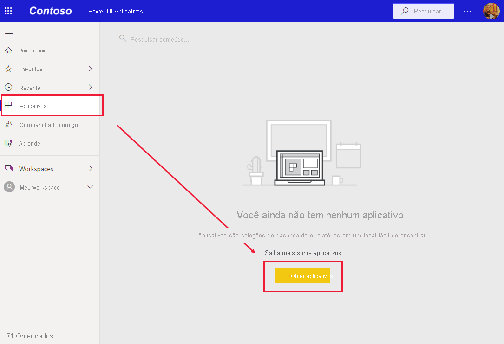
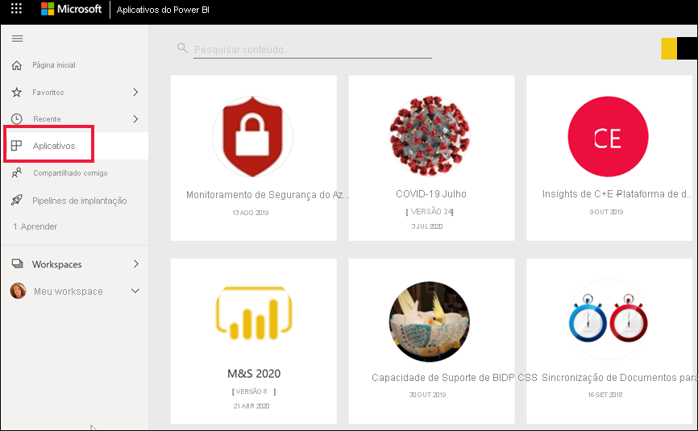
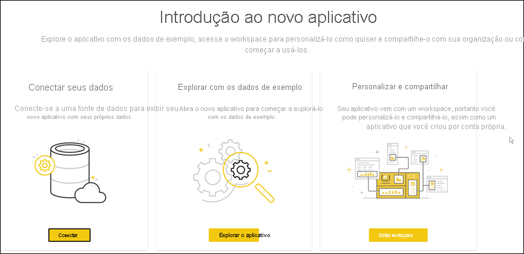
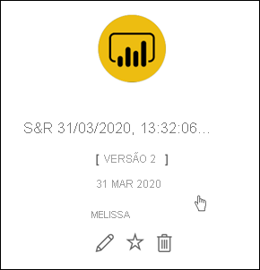

# Instalar e usar aplicativos com dashboards e relatórios no Power BI

[!INCLUDE[consumer-appliesto-ynny](../includes/consumer-appliesto-ynny.md)]

[!INCLUDE [power-bi-service-new-look-include](../includes/power-bi-service-new-look-include.md)]

Agora que você tem uma [noção básica sobre aplicativos](end-user-apps.md), vamos aprender a abrir e interagir com os aplicativos. 

## Maneiras de obter um novo aplicativo
Há várias maneiras de obter um novo aplicativo:
* Você pode obtê-lo no marketplace de aplicativos no Power BI.
* Use um link direto para um aplicativo que você recebeu do designer de aplicativo. 
* Um designer de aplicativo na sua organização pode instalar o aplicativo automaticamente na sua conta do Power BI.

Com o Power BI Mobile, você pode instalar apenas um aplicativo de um link direto. Se o designer de aplicativo instalar o aplicativo automaticamente, você o verá na sua lista de aplicativos.

## Aplicativos e licenças
Nem todos os usuários do Power BI podem ver aplicativos e interagir com eles. 
- Caso tenha uma licença gratuita, será possível abrir aplicativos armazenados na capacidade Premium e que foram compartilhados com você.  
- Se você tiver uma licença Pro, poderá abrir aplicativos compartilhados com você.

## Obter o aplicativo do marketplace de aplicativos do Power BI

Você pode encontrar e instalar aplicativos do marketplace de aplicativos do Power BI. No marketplace, você pode obter aplicativos organizacionais e de modelo.

- Um *aplicativo organizacional* está disponível para os usuários do Power BI na sua organização. Esses aplicativos também incluem dashboards e relatórios predefinidos que você pode usar no estado em que se encontram ou personalizá-los e compartilhá-los. Sua organização pode ter aplicativos para acompanhar as vendas, medir o desempenho ou analisar o sucesso da contratação.
- Um *aplicativo de modelo* é fornecido com dashboards e relatórios predefinidos que você pode usar para se conectar a muitos dos serviços que usa para executar seus negócios, como o Salesforce, o Microsoft Dynamics e o Google Analytics.

1. [Entre no serviço do Power BI](./end-user-sign-in.md), se você ainda não tiver feito isso. 

1. Depois de abrir o serviço do Power BI, selecione **Aplicativos > Obter aplicativos**. 

    

1. O marketplace de aplicativos do Power BI é aberto.

   

   Três guias estão disponíveis para uso:
   * **Todos os aplicativos** – Navegue pelos aplicativos de modelo e por todos os aplicativos organizacionais disponíveis para você. Os aplicativos de modelo são diferenciados pelo ícone de bolsa de compras no canto superior direito de seus blocos.
   * **Aplicativos organizacionais** – Navegue pelos aplicativos organizacionais compartilhados com você. 
   * **Aplicativos de modelo** – Navegue pelos aplicativos de modelo hospedados no AppSource.

   Como alternativa, você pode usar a caixa de pesquisa para obter uma seleção filtrada de aplicativos. Digitar parte do nome de um aplicativo ou de uma categoria, como finanças, análise, marketing etc., facilitará a localização do item que você está procurando. 

   A caixa de pesquisa é sensível à guia aberta – apenas aplicativos do tipo selecionado serão retornados. Se a guia **Todos os aplicativos** estiver aberta, os aplicativos organizacionais e de modelo serão retornados. Isso pode ser confuso quando um aplicativo organizacional e um aplicativo de modelo têm o mesmo nome. Apenas se lembre de que os blocos de aplicativo de modelo têm um ícone de sacola de compras no canto superior direito.

Quando você encontrar o aplicativo desejado, selecione **Obter agora** para instalá-lo.

   

* Se você estiver instalando um aplicativo organizacional, ele será imediatamente adicionado à sua lista de aplicativos.
* Se estiver instalando um aplicativo de modelo, você será levado para a oferta de aplicativo de modelo no AppSource. Confira [um exemplo](end-user-app-marketing.md) de como baixar e instalar um aplicativo de modelo de exemplo do marketplace de aplicativos do Power BI. O aplicativo é instalado, juntamente com um workspace com o mesmo nome.

   > [!NOTE]
   > Se você estiver usando uma licença de usuário gratuita, poderá baixar aplicativos, mas não poderá vê-los, a menos que atualize sua conta para uma conta do Power BI Pro ou a menos que o aplicativo esteja armazenado em uma capacidade Premium compartilhada. Para obter mais informações, confira as [licenças para usuários de negócios](end-user-license.md).

## Instalar um aplicativo por meio de um link direto
Você também pode instalar um aplicativo organizacional por meio de um link direto no email do designer de aplicativo.  

**No computador** 

Quando você seleciona o link no email, o serviço do Power BI ([https://app.powerbi.com](https://app.powerbi.com)) abre o aplicativo em um navegador. 

**No dispositivo móvel Android ou iOS** 

Quando você seleciona o link no email em seu dispositivo móvel, o aplicativo é instalado automaticamente e é aberto no aplicativo móvel. Talvez você precise entrar primeiro. 

## Interagir com os dashboards e relatórios no aplicativo
Reserve algum tempo para explorar os dados nos dashboards e relatórios que compõem o aplicativo. Você tem acesso a todas as interações padrão do Power BI, como filtragem, realce, classificação e busca detalhada.  Ainda está um pouco confuso com a diferença entre dashboards e relatórios?  Leia o [artigo sobre dashboards](end-user-dashboards.md) e o [artigo sobre relatórios](end-user-reports.md).  

### Abrir um aplicativo

Você instalou um aplicativo ou recebeu um aplicativo de um colega. Para ver esse aplicativo, abra a lista de conteúdo Aplicativos selecionando **Aplicativos** no painel de navegação.

Posicione o cursor sobre o aplicativo e selecione-o para abri-lo. Dependendo do aplicativo, você poderá receber um aviso semelhante a este:

Para obter diretrizes sobre qual a melhor opção a ser selecionada, confira [Instalar aplicativos de modelo](../connect-data/service-template-apps-install-distribute.md).

Posicione o cursor sobre o aplicativo para ver detalhes e selecione o cartão do aplicativo para abrir o aplicativo.

O aplicativo será aberto. Cada aplicativo terá uma aparência diferente: layout, visuais, cores e opções diferentes. Mas todos os aplicativos têm alguns recursos em comum.

1. Nome do aplicativo e hora da última atualização. Selecione a seta suspensa para pesquisar o proprietário e o contato da Ajuda.
1. Selecione **Power BI** para voltar à [Página Inicial](end-user-home.md).
1. A barra de ações. 
1. A tela da página do relatório.
1. O painel de navegação do aplicativo.  Abaixo do nome do aplicativo está a lista de páginas do relatório. Selecione o nome de uma página do relatório para abri-la. Atualmente, temos a página *Taxa de retorno* aberta. 
1. Selecione a seta para expandir o painel **Filtros**.

Explore também o workspace associado. [Saiba mais sobre os workspaces](end-user-workspaces.md). Selecione **Power BI** (número 2) para retornar à **Página Inicial** e clique em **Workspaces**. 

## Atualizar um aplicativo 

Periodicamente, os designers de aplicativo podem lançar novas versões dos aplicativos. A forma como você obtém a nova versão depende de como recebeu a original. 

* Se você obtiver o aplicativo por meio da sua organização, a atualização para a nova versão será totalmente transparente: você não precisará fazer nada. 

* Se você obtiver o aplicativo no AppSource, na próxima vez que abrir o aplicativo, verá uma faixa de notificação. A notificação permite que você saiba que uma nova versão está disponível. 

    1. Selecione **Obter** para fazer a atualização.  

        <!-- -->

    2. Quando precisar instalar o aplicativo atualizado, selecione **Instalar**. 

         

    3. Como você já tem uma versão desse aplicativo, decida se deseja substituir a versão existente ou se deseja instalar o aplicativo atualizado em um novo workspace.   

         

     > [!NOTE] 
     > A instalação de uma nova versão substitui as alterações que possam ter sido feitas nos relatórios e nos dashboards. Para manter seus relatórios e seus dashboard atualizados, salve-os com outro nome ou em uma localização diferente antes da instalação. 

    4. Depois de instalar a versão atualizada, selecione **Atualizar aplicativo** para concluir o processo de atualização. 

## Considerações e solução de problemas

- A capacidade de instalar aplicativos pode ser ativada e desativada pelo administrador do Power BI. Entre em contato com o departamento de TI ou o suporte técnico caso precise habilitar esse recurso.    
- O uso de aplicativos exige uma licença Pro ou que o aplicativo seja armazenado em uma capacidade Premium compartilhada. [Saiba mais sobre as licenças](end-user-license.md).

## Próximas etapas
* [Voltar para a visão geral de aplicativos](end-user-apps.md)
* [Exibir um relatório do Power BI](end-user-report-open.md)
* [Outras maneiras como o conteúdo é compartilhado com você](end-user-shared-with-me.md)

