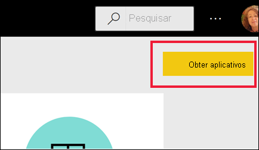
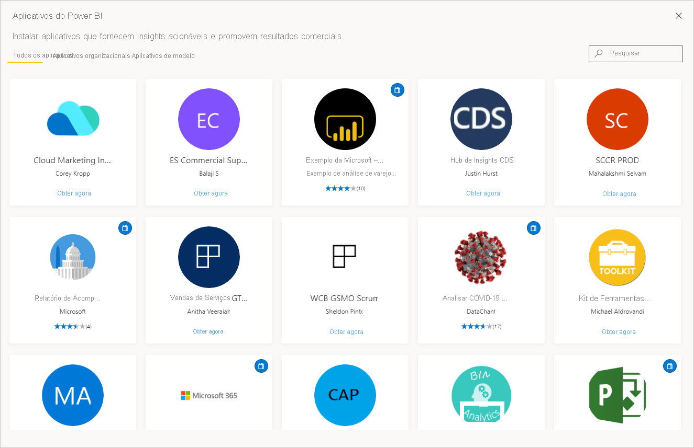
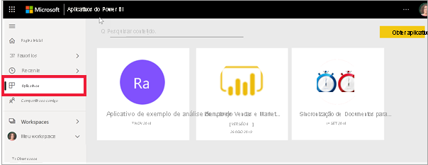

# Aplicativos no Power BI

[!INCLUDE[consumer-appliesto-ynny](../includes/consumer-appliesto-ynny.md)]

[!INCLUDE [power-bi-service-new-look-include](../includes/power-bi-service-new-look-include.md)]

## O que é um aplicativo do Power BI?
Um *aplicativo* é um tipo de conteúdo do Power BI que combina dashboards e relatórios relacionados em um só lugar. Um aplicativo pode ter um ou mais dashboards e um ou mais relatórios, todos agrupados. Os aplicativos são criados por *designers* do Power BI que distribuem e compartilham os aplicativos com colegas. O *designer* pode compartilhar um aplicativo de várias maneiras. Para saber mais, confira a seção abaixo **Obter um novo aplicativo**. 

## *Designers* de aplicativos e *usuários* de aplicativos
Dependendo da função, você pode ser alguém que cria aplicativos (*designer*) para seu próprio uso ou para compartilhar com colegas. Você também pode ser alguém (*usuário de negócios*) que recebe e baixa aplicativos criados por outras pessoas. Este artigo é destinado aos *usuários de negócios*.

Ver e abrir um aplicativo exige determinadas permissões. O destinatário deve ter uma licença do Power BI Pro ou o aplicativo deve ser compartilhado com o destinatário em um tipo especial de armazenamento em nuvem chamado **capacidade Premium**. Para saber mais sobre as licenças e a capacidade Premium, confira [Licenciamento para o serviço do Power BI](end-user-license.md).

## Vantagens dos aplicativos
Os aplicativos são um modo fácil, usado pelos *designers*, de compartilhar diferentes tipos de conteúdo de uma só vez. Os *designers* de aplicativos criam os dashboards e relatórios e os empacotam em um aplicativo. Os *designers* então compartilham ou publicam o aplicativo em um local onde você, o *usuário de negócios*, poderá acessá-lo. Como os dashboards e relatórios relacionados são empacotados juntos, é mais fácil para você encontrar e instalar ambos no serviço do Power BI ([https://powerbi.com](https://powerbi.com)) e no dispositivo móvel. Depois de instalar um aplicativo, não será necessário lembrar os nomes dos muitos dashboards ou relatórios diferentes, uma vez que eles são reunidos em um aplicativo, no navegador ou no dispositivo móvel.

Com os aplicativos, sempre que o autor do aplicativo liberar atualizações, você verá automaticamente as alterações. O autor também controla a frequência com a qual os dados são atualizados, de forma que você não precisa se preocupar em manter-se atualizado. 

<!-- add conceptual art -->
## Obter um novo aplicativo
Há várias diferentes maneiras de obter um novo aplicativo. É possível pesquisar, localizar e instalar aplicativos, além disso, os designers de aplicativos podem compartilhá-los com você. 

### Encontrar e instalar aplicativos por meio do marketplace de aplicativos do Power BI
Um modo de localizar aplicativos é selecionar **Obter aplicativo** na tela **Aplicativos** do Power BI. 

Navegue pela lista de aplicativos no marketplace de aplicativos do Power BI até encontrar um que você queira instalar. Escolha uma opção em **Aplicativos organizacionais**, que só ficam disponíveis para as pessoas de sua empresa, ou em **Aplicativos de modelo**, que são publicados pela Microsoft e pela comunidade para serem instalados por qualquer usuário do Power BI. 

Há algumas outras maneiras de obter aplicativos. Algumas dessas maneiras estão listadas abaixo. No entanto, para ver instruções passo a passo detalhadas de como obter e explorar um aplicativo, confira [Abrir e interagir com um aplicativo](end-user-app-view.md).

* O designer de aplicativo pode instalá-lo automaticamente na sua conta do Power BI e, na próxima vez que você abrir o serviço do Power BI, verá o novo aplicativo na lista de conteúdo **Aplicativos**. 
* O designer de aplicativo pode enviar um link direto para um aplicativo. A seleção do link abre o aplicativo no serviço do Power BI.
* No Power BI no seu dispositivo móvel, você só pode instalar um aplicativo de um link direto, não do marketplace de aplicativos. Se o autor do aplicativo instalar o aplicativo automaticamente, você o verá na sua lista de aplicativos. 

Seus aplicativos são organizados na lista de conteúdo **Aplicativos**. Basta selecionar **Aplicativos** para exibir seus aplicativos. Passe o mouse sobre um aplicativo para ver a data da última atualização e o proprietário. 

## Próximas etapas
* [Abrir e interagir com um aplicativo](end-user-app-view.md)
* [Outras maneiras de compartilhar conteúdo](end-user-shared-with-me.md)

