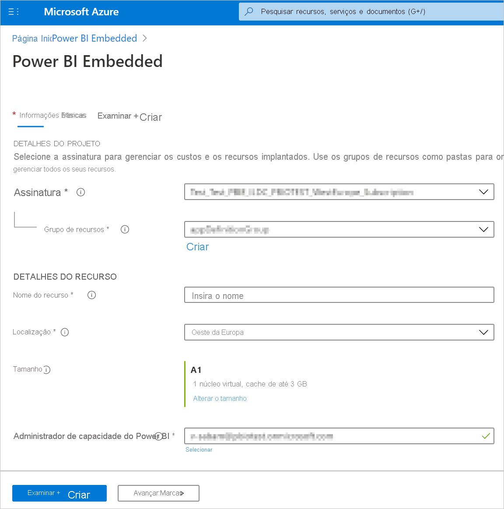
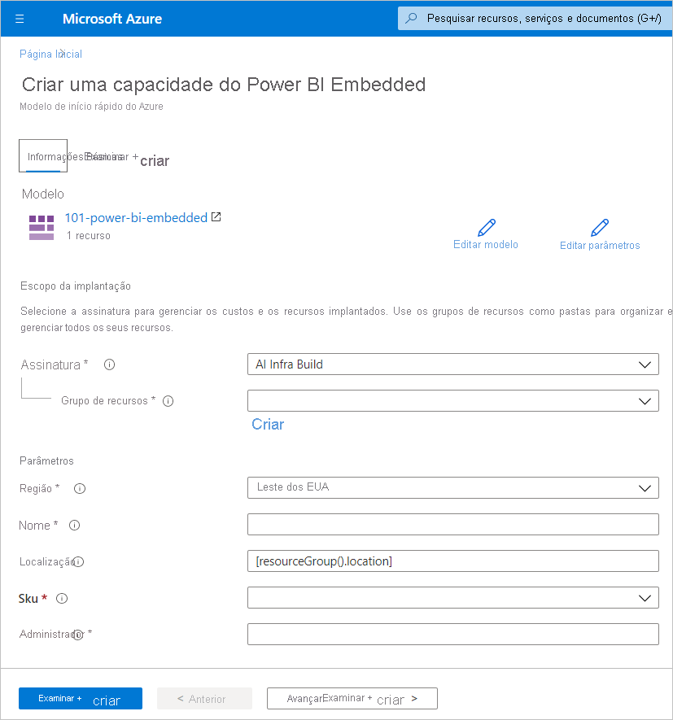
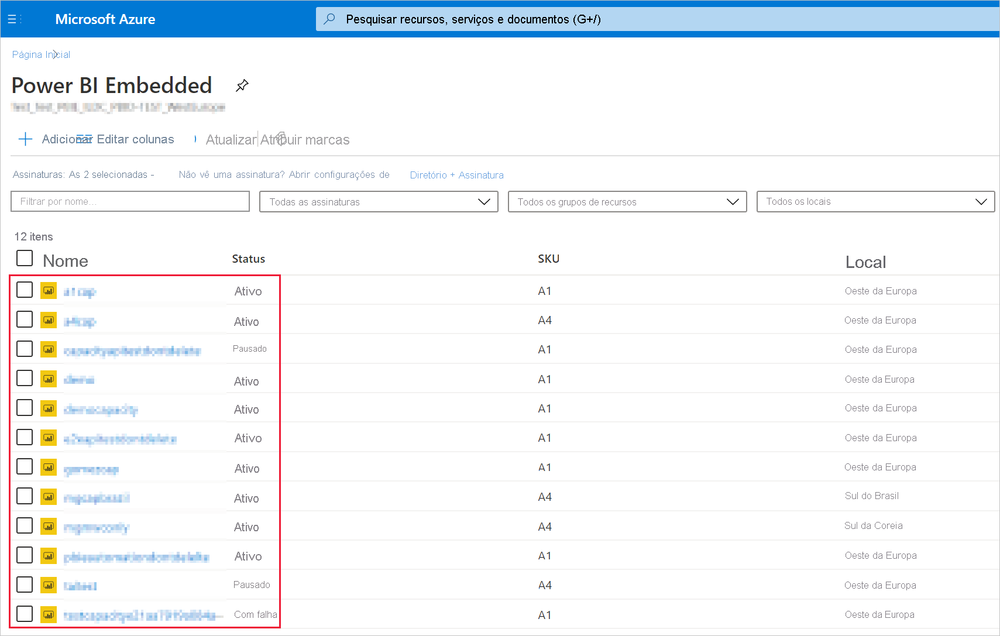
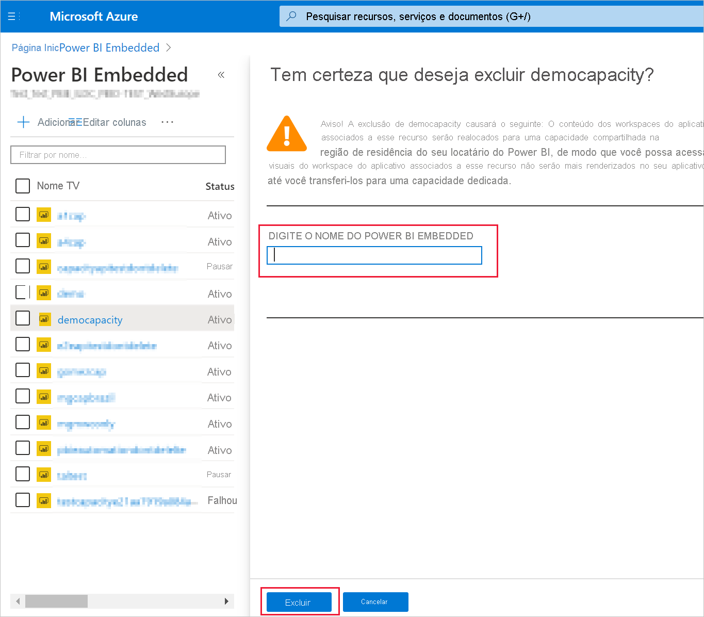

# <a name="create-power-bi-embedded-capacity-in-the-azure-portal"></a>Criar uma capacidade do Power BI Embedded no portal do Azure

Este artigo explica como criar uma capacidade do [Power BI Embedded](azure-pbie-what-is-power-bi-embedded.md) no Microsoft Azure. O Power BI Embedded simplifica as funcionalidades do Power BI, ajudando você a adicionar rapidamente visuais, relatórios e dashboards impressionantes aos aplicativos.

## <a name="before-you-begin"></a>Antes de começar

Para concluir este início rápido, você precisa:

* **Assinatura do Azure:** visite a [Avaliação Gratuita do Azure](https://azure.microsoft.com/free/) para criar uma conta.

* **Azure Active Directory:** sua assinatura precisa estar associada a um locatário do Azure AD (Azure Active Directory). Além disso, ***você precisa estar conectado ao Azure com uma conta nesse locatário***. Não há suporte para contas Microsoft. Para obter mais informações, confira [Autenticação e permissões de usuário](https://docs.microsoft.com/azure/analysis-services/analysis-services-manage-users).

* **Locatário do Power BI:** pelo menos uma conta no seu locatário do Azure AD precisa estar inscrita no Power BI.

* **Grupo de recursos:** use um grupo de recursos existente ou [crie um](https://docs.microsoft.com/azure/azure-resource-manager/resource-group-overview).

## <a name="create-a-capacity"></a>Criar uma capacidade

Antes de criar uma capacidade do Power BI Embedded, verifique se você entrou no Power BI pelo menos uma vez.

# <a name="portal"></a>[Portal](#tab/portal)

1. Faça logon no [Portal do Azure](https://portal.azure.com/).

2. Na caixa de pesquisa, procure *Power BI Embedded*.

3. No Power BI Embedded, selecione **Adicionar**.

4. Preencha as informações necessárias e, em seguida, clique em **Examinar + Criar**.

    

    * **Assinatura** – a assinatura na qual você deseja criar a capacidade.

    * **Grupo de recursos** – o grupo de recursos que contém essa nova capacidade. Escolha um grupo de recursos existente ou crie outro. Para obter mais informações, confira [Visão geral do Azure Resource Manager](https://docs.microsoft.com/azure/azure-resource-manager/resource-group-overview).

    * **Nome do recurso** – o nome do recurso da capacidade.

    * **Local** – o local em que o Power BI está hospedado para seu locatário. O local padrão é sua região de residência, mas você pode alterar o local usando [Opções de Multi-Geo](embedded-multi-geo.md).

    * **Tamanho** – o [SKU A](../../admin/service-admin-premium-purchase.md#purchase-a-skus-for-testing-and-other-scenarios) necessário. Para obter mais informações, confira [Memória e capacidade de computação do SKU](/embedded/embedded-capacity.md#sku-memory-and-computing-power).

    * **Administrador de capacidade do Power BI** – um administrador para a capacidade.
        >[!NOTE]
        >* Por padrão, o administrador de capacidade é o usuário que está criando a capacidade.
        >* Você pode selecionar um usuário ou entidade de serviço diferente, como um administrador de capacidade.
        >* O administrador de capacidade deve pertencer ao locatário em que a capacidade é provisionada. Os usuários B2B (Business to Business) não podem ser administradores de capacidade.

# <a name="azure-cli"></a>[CLI do Azure](#tab/CLI)

### <a name="use-azure-cloud-shell"></a>Usar o Azure Cloud Shell

O Azure hospeda o Azure Cloud Shell, um ambiente de shell interativo que pode ser usado por meio do navegador. É possível usar o bash ou o PowerShell com o Cloud Shell para trabalhar com os serviços do Azure. É possível usar os comandos pré-instalados do Cloud Shell para executar o código neste artigo sem precisar instalar nada no seu ambiente local.

Para iniciar o Azure Cloud Shell:

| Opção | Exemplo/Link |
|-----------------------------------------------|---|
| Selecione **Experimente** no canto superior direito de um bloco de código. Selecionar **Experimente** não copia automaticamente o código para o Cloud Shell. |  |
| Acesse [https://shell.azure.com](https://shell.azure.com) ou selecione o botão **Iniciar o Cloud Shell** para abri-lo no navegador. | [](https://shell.azure.com) |
| Selecione o botão **Cloud Shell** na barra de menus no canto superior direito do [portal do Azure](https://portal.azure.com). |  |

Para executar o código neste artigo no Azure Cloud Shell:

1. Inicie o Cloud Shell.

2. Clique no botão **Copiar** no bloco de código para copiá-lo.

3. Cole o código na sessão do Cloud Shell ao pressionar **Ctrl**+**Shift**+**V** no Windows e no Linux ou **Cmd**+**Shift**+**V** no macOS.

4. Pressione **Enter** para executar o código.

## <a name="prepare-your-environment"></a>Prepare o seu ambiente

Os comandos de capacidade do Power BI Embedded exigem a versão 2.3.1 ou posterior da CLI do Azure. Execute `az --version` para localizar a versão e as bibliotecas dependentes que estão instaladas. Para instalar ou atualizar, confira [Instalar a CLI do Azure](/cli/azure/install-azure-cli).

1. Entrar.

   Entre usando o comando [az login](/cli/azure/reference-index#az-login) se estiver usando uma instalação local da CLI.

    ```azurecli
    az login
    ```

    Siga as etapas exibidas em nosso terminal para concluir o processo de autenticação.

2. Instale a extensão de CLI do Azure.

    Ao trabalhar com referências de extensão para a CLI do Azure, você deve primeiro instalar a extensão.  As extensões da CLI do Azure fornecem acesso a comandos experimentais e de pré-lançamento que ainda não foram enviados como parte da CLI principal.  Para saber mais sobre extensões, incluindo atualização e desinstalação, confira [Usar extensões com a CLI do Azure](/cli/azure/azure-cli-extensions-overview).

    Instale a extensão para a capacidade do Power BI Embedded executando o seguinte comando:

    ```azurecli
    az extension add --name powerbidedicated
    ```

### <a name="create-a-capacity-with-azure-cli"></a>Criar uma capacidade com a CLI do Azure

Use o comando [az Power BI embedded-capacity create](https://docs.microsoft.com/cli/azure/ext/powerbidedicated/powerbi/embedded-capacity?view=azure-cli-latest#ext-powerbidedicated-az-powerbi-embedded-capacity-create) para criar uma capacidade.

```azurecli
az powerbi embedded-capacity create --location westeurope
                                    --name
                                    --resource-group
                                    --sku-name "A1"
                                    --sku-tier "PBIE_Azure"
```

### <a name="delete-a-capacity-with-azure-cli"></a>Excluir uma capacidade com a CLI do Azure

Para excluir uma capacidade usando a CLI do Azure, use o comando [az powerbi embedded-capacity delete](https://docs.microsoft.com/cli/azure/ext/powerbidedicated/powerbi/embedded-capacity?view=azure-cli-latest#ext-powerbidedicated-az-powerbi-embedded-capacity-delete).

```azurecli
az powerbi embedded-capacity delete --name
                                    --resource-group
```

### <a name="manage-your-capacity-with-azure-cli"></a>Gerenciar sua capacidade com a CLI do Azure

É possível exibir todos os comandos da CLI do Azure do Power BI Embedded com [az powerbi](https://docs.microsoft.com/cli/azure/ext/powerbidedicated/powerbi?view=azure-cli-latest).

# <a name="arm-template"></a>[Modelo de ARM](#tab/ARM-template)

### <a name="use-resource-manager-template"></a>Usar modelo do Resource Manager

O [modelo do Resource Manager](https://docs.microsoft.com/azure/azure-resource-manager/templates/overview) é um arquivo JSON (JavaScript Object Notation) que define a infraestrutura e a configuração do projeto. O modelo usa a sintaxe declarativa, que permite declarar o que você pretende implantar sem precisar gravar a sequência de comandos de programação para criá-lo. Caso deseje saber mais sobre como desenvolver modelos do Resource Manager, confira a [documentação do Resource Manager](https://docs.microsoft.com/azure/azure-resource-manager/) e a [referência de modelos](https://docs.microsoft.com/azure/templates/).

Se você não tiver uma assinatura do Azure, crie uma conta [gratuita](https://azure.microsoft.com/free/) antes de começar.

### <a name="review-the-template"></a>Examinar o modelo

O modelo usado neste início rápido é proveniente dos [Modelos de Início Rápido do Azure](https://azure.microsoft.com/resources/templates/101-power-bi-embedded).

```json
{
    "$schema": "https://schema.management.azure.com/schemas/2019-04-01/deploymentTemplate.json#",
    "contentVersion": "1.0.0.0",
    "parameters": {
        "name": {
            "type": "string",
            "metadata": {
              "description": "The capacity name, which is displayed in the Azure portal and the Power BI admin portal"
            }
        },
        "location": {
            "type": "string",
            "defaultValue": "[resourceGroup().location]",
            "metadata": {
              "description": "The location where Power BI is hosted for your tenant"
            }
        },
        "sku": {
            "type": "string",
            "allowedValues": [
                "A1",
                "A2",
                "A3",
                "A4",
                "A5",
                "A6"
            ],
            "metadata": {
              "description": "The pricing tier, which determines the v-core count and memory size for the capacity"
            }
        },
        "admin": {
            "type": "string",
            "metadata": {
              "description": "A user within your Power BI tenant, who will serve as an admin for this capacity"
            }
        }
    },
    "resources": [
        {
            "type": "Microsoft.PowerBIDedicated/capacities",
            "apiVersion": "2017-10-01",
            "name": "[parameters('name')]",
            "location": "[parameters('location')]",
            "sku": {
                "name": "[parameters('sku')]"
            },
            "properties": {
                "administration": {
                    "members": [
                        "[parameters('admin')]"
                    ]
                }
            }
        }
    ]
}
```

Um recurso do Azure está definido no modelo [Microsoft.PowerBIDedicated/capacities Az](https://docs.microsoft.com/azure/templates/microsoft.powerbidedicated/allversions) – Criar uma capacidade do Power BI Embedded.

### <a name="deploy-the-template"></a>Implantar o modelo

1. Selecione o link a seguir para entrar no Azure e abrir um modelo. O modelo cria uma capacidade de Power BI Embedded.

    [](https://portal.azure.com/#create/Microsoft.Template/uri/https%3a%2f%2fraw.githubusercontent.com%2fAzure%2fazure-quickstart-templates%2fmaster%2f101-power-bi-embedded%2fazuredeploy.json)

2. Preencha as informações necessárias e, em seguida, clique em **Examinar + Criar**.

    

    * **Assinatura** – a assinatura na qual você deseja criar a capacidade.

    * **Grupo de recursos** – o grupo de recursos que contém essa nova capacidade. Escolha um grupo de recursos existente ou crie outro. Para obter mais informações, confira [Visão geral do Azure Resource Manager](https://docs.microsoft.com/azure/azure-resource-manager/resource-group-overview).

    * **Região** – a região à qual a capacidade pertencerá.

    * **Nome** – o nome da capacidade.

    * **Local** – o local em que o Power BI está hospedado para seu locatário. O local padrão é sua região de residência, mas você pode alterar o local usando [Opções de Multi-Geo](/embedded/embedded-multi-geo.md).

    * **SKU** – o [SKU A](../../admin/service-admin-premium-purchase.md#purchase-a-skus-for-testing-and-other-scenarios) necessário. Para obter mais informações, confira [Memória e capacidade de computação do SKU](/embedded/embedded-capacity.md#sku-memory-and-computing-power).

    * **Administrador** – um administrador para a capacidade.
        >[!NOTE]
        >* Por padrão, o administrador de capacidade é o usuário que está criando a capacidade.
        >* Você pode selecionar um usuário ou entidade de serviço diferente, como um administrador de capacidade.
        >* O administrador de capacidade deve pertencer ao locatário em que a capacidade é provisionada. Os usuários B2B (Business to Business) não podem ser administradores de capacidade.

### <a name="validate-the-deployment"></a>Validar a implantação

Para validar a implantação, faça o seguinte:

1. Entre no [Portal do Azure](https://portal.azure.com/).

2. Na caixa de pesquisa, procure *Power BI Embedded*.

3. Examine a lista de capacidades do Power BI Embedded e verifique se a capacidade que você criou está listada.

    

### <a name="clean-up-resources"></a>Limpar recursos

Para excluir a capacidade que você criou, siga estas etapas:

1. Entre no [Portal do Azure](https://portal.azure.com/).

2. Na caixa de pesquisa, procure *Power BI Embedded*.

3. Abra o menu de contexto da capacidade que você criou e clique em **Excluir**.

    

4. Na página confirmação, digite o nome da capacidade e clique em **Excluir**.

    

---

## <a name="next-steps"></a>Próximas etapas

>[!div class="nextstepaction"]
>[Gerenciar capacidades](../../admin/service-admin-premium-manage.md)

>[!div class="nextstepaction"]
>[Pausar e iniciar a capacidade do Power BI Embedded no portal do Azure](azure-pbie-pause-start.md)

>[!div class="nextstepaction"]
>[Inserir conteúdo do Power BI em um aplicativo para seus clientes](embed-sample-for-customers.md)

>[!div class="nextstepaction"]
>[Mais perguntas? Experimente perguntar à Comunidade do Power BI](https://community.powerbi.com/)