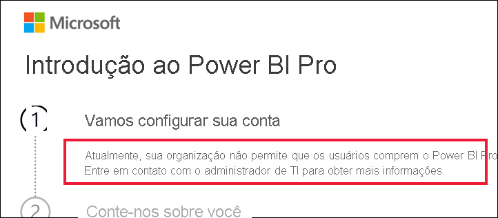

# O que fazer se a compra do Power BI Pro estiver desabilitada

Você tentou comprar o Power BI Pro e recebeu uma mensagem informando que a sua organização não permite que os usuários façam isso. Por vários motivos, algumas organizações bloqueiam a compra de autoatendimento do Power BI Pro para os membros.  Por exemplo, sua organização pode ter uma política em que todas as licenças e assinaturas são gerenciadas por um departamento de TI centralizado ou pelo suporte técnico. 

## Solução
Para concluir a compra, entre em contato com o departamento de TI ou o suporte técnico e peça para eles [seguirem estas instruções para fornecer a você uma licença](../admin/service-admin-manage-licenses.md).

## Próximas etapas
[Recursos do Power BI por tipo de licença](service-features-license-type.md)